# Table of Contents
- [1. Introduction](#1-introduction)
- [2. Data Description](#2-data-description)
- [3. Preprocessing](#3-preprocessing)
- [4. Methodology](#4-methodology)
  - [4.1. 개별 구의 가격 사이클 및 변곡점 탐지](#41-개별-구의-가격-사이클-및-변곡점-탐지)
  - [4.2. 패널 데이터 구조 구축 및 패널 회귀 분석](#42-패널-데이터-구조-구축-및-패널-회귀-분석)
  - [4.3. Dynamic Factor Model DFM 분석](#43-dynamic-factor-model-dfm-분석)
  - [4.4. DTW 기반 구별 패턴 클러스터링](#44-dtw-기반-구별-패턴-클러스터링)
- [5. Results](#5-results)
  - [5.1 구별 Cycle Detection Results](#51-구별-cycle-detection-results)
  - [5.2 Panel Regression Results](#52-panel-regression-results)
  - [5.3 Dynamic Factor Model DFM Results](#53-dynamic-factor-model-dfm-results)
  - [5.4 Clustering Results](#54-clustering-results)
- [6. Discussion](#6-discussion)
- [7. Conclusion](#7-conclusion)
- [8. Appendix](#8-appendix)
  - [A. 25개 구 분석](#a-25개-구-분석)
  - [B. PanelOLS Full Output Entity FE + Time FE](#b-panelols-full-output-entity-fe--time-fe)
- License
- Open Source Notice

---

# **1. Introduction**

최근 토지 거래 허가제 관련 뉴스가 연이어 보도되며 부동산 시장에 대한 관심이 높아지고 있다. 개인적으로도 원룸에 거주하며 언젠가는 나만의 집을 갖고 싶은 꿈이 있었다. 이러한 관심을 바탕으로, 서울시 아파트 매매 데이터를 분석하여 부동산 시장 전반의 패턴과 주기적인 사이클을 파악하고자 한다.

본 연구는 서울시 25개 구별 아파트 매매 데이터를 활용하여 시장의 공통 요인과 구별 특성을 동시에 분석한다. 이를 통해 개별 구별로 반복적으로 나타나는 가격 변동 패턴과 전체 시장의 동조 현상을 확인할 수 있으며, 데이터 기반으로 부동산 사이클을 정량적으로 탐지하고자 한다.

구체적으로, 본 연구의 목적은 다음과 같다.

1. **시장 전체의 공통 주기 파악:** Fourier 변환과 Dynamic Factor Model(DFM)을 활용하여 전체 시장에 공통적으로 나타나는 주기적 변동을 식별한다.
2. **개별 구별 패턴 분석:** 구별 데이터에서 DFM과 클러스터링 기법을 적용하여 지역별 차별화된 움직임을 탐지한다.
3. **향후 정책·시장적 검토 가능성:** 데이터에서 확인된 패턴을 바탕으로, 이후 정책 발표나 외부 요인이 시장에 미치는 영향을 분석할 수 있는 기초 자료를 마련한다.

이 연구는 단순히 과거 데이터를 관찰하는 것을 넘어, 서울시 아파트 시장의 구조적 이해와 향후 변동 예측을 위한 기초 자료를 제공하고자 한다.

---
[Back to Table of Contents](#table-of-contents)

# **2. Data Description**

본 프로젝트에서는 국토교통부 실거래가 공개시스템 ([https://rt.molit.go.kr](https://rt.molit.go.kr/pt/xls/xls.do?&mobileAt=))에서 제공하는 **서울특별시 아파트 실거래 자료(2006.01.01–2025.08.31)**를 활용하였다.


자료는 다음의 검색 조건을 통해 Excel 파일로 수집하였다.

* **계약 일자**: 2006년 1월 1일 ~ 2025년 8월 31일
* **매물 유형**: 아파트
* **주소 기준**: 도로명
* **지역 범위**: 서울특별시 전체 25개 구
* **면적·금액 필터**: 제한 없음

실거래 자료는 건별 계약 정보로 구성되어 있으며, 주요 변수는 아래와 같다.

| 변수명        | 설명                     |
| ---------- | ---------------------- |
| 시군구        | “서울특별시 XX구 YY동” 형식의 주소 |
| 전용면적(㎡)    | 실사용 면적                 |
| 계약년월 / 계약일 | 계약 체결 시점               |
| 거래금액(만원)   | 실거래 신고 금액              |
| 단지명        | 아파트 단지명                |
| 건축년도       | 준공년도                   |
| 도로명        | 도로명 주소 정보              |

다음 Column은 삭제 후 사용함 : NO, 번지, 본번, 부번, 동, 층, 매수자, 매도자, 해제사유발생일, 거래유형, 중개사소재지, 등기일자, 주택유형

---
[Back to Table of Contents](#table-of-contents)

# **3. Preprocessing**

## **3.1. 두 시트 결합 및 날짜 생성**

원본 데이터는 계약년월이 `YYYYMM`, 계약일이 `DD` 형태로 분리되어 있으며,
두 값을 문자열로 변환한 뒤 `"YYYYMMDD"` 형태로 합쳐 날짜로 파싱하였다.

```python
df['date'] = pd.to_datetime(
    df['계약년월'] + df['계약일'],
    format="%Y%m%d",
    errors='coerce'
)
df = df[df['date'].notna()]
```

이를 통해 **모든 거래 건이 월·일 단위까지 명확히 정렬된 시계열 구조**로 재구성되었다.

---

## **3.2. 주소 분해: 구/동 추출**

`시군구` 변수는 `"서울특별시 중랑구 면목동"`과 같은 문자열로 구성되어 있어,
본 연구에서는 분석 단위를 구별로 다루기 위해 이를 세 부분으로 나누어 사용하였다.

* `"서울특별시"` → 제거
* `"XX구"` → 구 단위 변수
* `"YY동"` → 동 단위 변수

```python
df[['시', '구', '동']] = df['시군구'].str.split(expand=True)
df = df.drop(columns=['시'])
```

이 과정에서 **서울 25개 구 단위의 시계열 분석이 가능하도록 주소 체계가 정규화**되었다.

---

## **3.3. 수치형 변수 정제**

실거래 금액, 건축년도, 전용면적 등의 변수는 문자열·결측치·콤마 등이 포함되어 있어
이를 정수 또는 실수로 변환하였다.

* `거래금액(만원)` → 콤마 제거 후 정수 변환
* `전용면적(㎡)` → float
* `건축년도` → 숫자 변환 불가 값은 0 처리

```python
df['거래금액(만원)'] = pd.to_numeric(
    df['거래금액(만원)'].astype(str).str.replace(",", ""),
    errors='coerce'
).fillna(0).astype(int)
```

해당 변환을 통해 **모든 거래 기록이 통계 분석 및 시계열 변환에 바로 활용 가능한 형태**로 표준화되었다.

---

## **3.4. 분석용 컬럼 정리 및 저장**

필요한 변수만 선별하여 다음 순서로 재배치하였다.

* `date`
* `구`
* `동`
* `전용면적(㎡)`
* `거래금액(만원)`
* `건축년도`
* `단지명`
* `도로명`

최종 전처리된 자료는 CSV 파일로 저장해 이후 단계의
월별 집계, 실질가격 변환, Dynamic Factor Model,
그리고 DTW 클러스터링 등에 사용된다.

```python
df.to_csv("data/apt_sale_cleaned.csv", index=False, encoding="utf-8-sig")
```

## **3.5. 전용면적 및 노후도 버킷팅(Bucketing)**

아파트 가격은 전용면적과 건축년도 같은 물리적 특성에 따라 구조적인 차이를 보이기 때문에,
분석 과정에서 **거래 금액의 분포를 안정화하고 구간별 비교가 가능하도록**
전용면적(㎡)과 노후도(건축년도 기준)를 범주형 변수로 재구성하였다.

### **(1) 전용면적 버킷 생성**

전용면적은 다음 네 가지 구간으로 구분하였다.

* **< 40㎡**
* **40–60㎡**
* **60–85㎡**
* **> 85㎡**

이 구간은 서울 아파트 시장에서 일반적으로 구분되는 **소형–중형–중대형–대형** 면적대와 일치하며,
각 면적대는 가격 수준과 변동 패턴이 뚜렷하게 다르기 때문에
시계열 분석 및 군집 분석에서 군집 왜곡을 막는 데 유효하다.

```python
def area_bucket(area):
    if area < 40:
        return "<40"
    elif area < 60:
        return "40-60"
    elif area < 85:
        return "60-85"
    else:
        return ">85"
```

### **(2) 노후도 계산 및 버킷팅**

각 거래 건의 **노후도(age)**는

```python
age = (거래년도) - (건축년도)
```

로 계산하였으며, 다시 다음의 네 구간으로 범주화하였다.

* **< 5년** (신축)
* **5–15년** (준신축)
* **15–30년** (일반 노후)
* **> 30년** (노후)

이는 서울 아파트 시장에서 가격 형성 요인으로 가장 강력하게 작용하는 특성 중 하나가
건축년도이기 때문이다. 특히 신축과 30년 이상 노후 단지는
동일 면적이라도 가격 구조가 완전히 다르기 때문에
이를 구분하지 않을 경우 후속 분석에서 평균 왜곡이 발생한다.

최종 데이터는 다음의 형태로 확장되었다.

* `area_bucket`: 전용면적 구간
* `age`: 노후도(연 단위)
* `age_bucket`: 노후도 구간

가공된 데이터는 `"apt_sale_cleaned_bucketing.csv"`로 저장하여
이상치 제거 및 월별 집계 단계에서 사용하였다.

---

## **3.6. IQR 기반 이상치 제거**

서울 아파트 실거래 데이터는 단지명, 면적대, 층수, 특수 거래 등 다양한 요인의 영향으로
일부 **극단값(outlier)**이 존재한다.
특히 특정 단지의 일부 이례적 고가·저가 거래는
월평균 가격 및 구 단위 지수 계산 시 왜곡을 유발할 수 있다.

이를 완화하기 위해 **사분위수 기반 IQR(Interquartile Range) 방법**을 활용하여
면적대별·단지별로 이상치를 제거하였다.

### **(1) 제거 방식**

각 단지(`단지명`)와 면적 버킷(`area_bucket`)을 하나의 그룹으로 묶고,
각 그룹 내에서 다음 경계를 벗어난 거래를 제거한다.

* Q1 − 1.5×IQR 미만
* Q3 + 1.5×IQR 초과

```python
def remove_outliers_iqr(group, column="거래금액(만원)"):
    Q1 = group[column].quantile(0.25)
    Q3 = group[column].quantile(0.75)
    IQR = Q3 - Q1
    lower_bound = Q1 - 1.5 * IQR
    upper_bound = Q3 + 1.5 * IQR
    return group[(group[column] >= lower_bound) & (group[column] <= upper_bound)]
```

### **(2) 그룹별 IQR 적용 이유**

* 동일 단지라도 면적대에 따라 금액 수준과 분포가 완전히 다르기 때문에
  **단지 + 면적대** 수준에서 이상치를 제거해야 정상 분포를 보정할 수 있다.
* 구 단위로 한꺼번에 IQR을 적용하면, 특정 고급 단지의 고가 거래가 전체 상한선을 끌어올려
  실제 이상치가 제거되지 않는 문제가 발생한다.
* 면적대·단지 수준의 미세한 그룹화는 이후 **월별 지수화 작업의 안정성**을 크게 높여준다.

### **(3) 최종 데이터**

이상치 제거가 완료된 데이터는
`"apt_sale_cleaned_iqr.csv"`에 저장되며,
이후 단계인 월별 집계, 실질가격 변환, 패널 분석,
Dynamic Factor Model(DFM) 적용의 입력으로 사용된다.

아래는 **월별 집계 → 가중 지수 → 실질 가격 변환**의 전체 과정을
보고서에 바로 포함할 수 있는 서술 방식으로 정돈한 내용이야.
각 단계가 왜 필요한지, 어떤 방식으로 구현했는지, 분석 전체 흐름 속에서 어떤 역할을 하는지를 명확히 설명하도록 구성했다.

## **3.7. 월별 집계(Monthly Aggregation)**

전처리된 거래 자료는 건별 시점·면적·노후도·단지 특성이 모두 다르기 때문에,
그대로 사용하면 월 단위 시계열 비교가 어렵다.
이를 해결하기 위해 거래 데이터를 **구 × 면적버킷 × 노후도버킷** 단위로 묶어
매월의 대표값을 계산했다.

### **(1) 집계 단위 설정 이유**

* 각 구의 거래 특성을 면적별·노후도별로 세분화함으로써
  구조적으로 다른 유형의 아파트를 동일 선상에 놓고 단순 평균하는 왜곡을 방지한다.
* 중앙값(median)을 사용함으로써 극단값(outlier)의 영향을 추가로 완화한다.
* 구별 주택 시장의 변화를 월 단위로 분석할 수 있도록 시계열 정규화를 수행한다.

### **(2) 계산 방식**

각 거래의 날짜(`date`)에서 `"YYYY-MM"` 형식의 `year_month`를 생성한 뒤,
다음 집계를 수행했다.

* **price_median**:
  동일 월 × 구 × 면적버킷 × 노후도버킷 내 거래금액의 중앙값
* **count**:
  집계 구간 내 거래 건수

대표 코드:

```python
monthly_grouped = df.groupby(
    ['year_month', '구', 'area_bucket', 'age_bucket']
)['거래금액(만원)'].median().reset_index()

monthly_grouped['count'] = df.groupby(
    ['year_month', '구', 'area_bucket', 'age_bucket']
)['거래금액(만원)'].count().values
```

출력 파일: **`monthly_grouped.csv`**
이 데이터는 이후 **구별 월별 가격지수 계산**의 입력으로 사용된다.

---

## **3.8. 가중 지수 계산(Weighted Price Index)**

월별 집계 데이터는 면적·노후도별로 쪼개져 있기 때문에,
이를 다시 **구 단위의 단일 월별 가격지수**로 통합할 필요가 있다.

단순 평균을 사용할 경우 특정 면적대의 과대표집 문제가 발생하기 때문에,
본 연구에서는 **거래건수를 가중치로 사용하는 가중평균(weighted mean)**을 적용했다.

### **(1) 목적**

* 면적·노후도 분포가 시기별로 변하더라도
  구 전체의 가격 수준을 일관되게 측정한다.
* 거래량이 많은 구간에 더 높은 비중을 부여하여
  실제 시장 움직임과 가까운 지수를 생성한다.

### **(2) 계산 방식**

각 월·구 단위에서 다음 공식을 사용했다.

$$
Index_{t, gu}=\frac{\sum_{i} (MedianPrice_{i} \times Count_{i})}{\sum_{i} Count_{i}}
$$

코드 구현:

```python
weighted_index = df.groupby(['year_month', '구']).apply(
    lambda x: (x['price_median'] * x['count']).sum() / x['count'].sum()
).reset_index(name='weighted_price_index')
```

출력 파일: **`weighted_index.csv`**
이 값은 **명목 가격지수(Nominal Price Index)**이며,
물가(인플레이션) 반영 이전의 지수이다.

---

## **3.9. 실질 가격 변환(Real Price Index Conversion)**

명목 가격지수는 명확한 추세를 보여주지만,
2006~2025 기간 동안 소비자물가(CPI)가 꾸준히 상승해왔기 때문에
단순 비교만으로는 **실질적인 가격 변동**을 파악하기 어렵다.

따라서 KOSIS(국가통계포털) ([https://kosis.kr/](https://kosis.kr/statHtml/statHtml.do?sso=ok&returnurl=https%3A%2F%2Fkosis.kr%3A443%2FstatHtml%2FstatHtml.do%3Flist_id%3D%26obj_var_id%3D%26seqNo%3D%26docId%3D02881%26tblId%3DDT_1J22003%26vw_cd%3DMT_ZTITLE%26orgId%3D101%26conn_path%3DE1%26markType%3DS%26itm_id%3D%26lang_mode%3Dko%26scrId%3D%26itmNm%3D%EC%A0%84%EA%B5%AD%26))에서 제공하는 **소비자물가지수(CPI, 기준=2020=100)**를 활용하여
각 월의 가격을 실질 가격(real price)으로 디플레이트하였다.

### **(1) CPI 데이터 처리**

* 2020년을 기준값 100으로 맞춘 지수
* 첫 번째 행(헤더 행)을 제외한 하나의 행을 선택
* `"2006-01" ~ "2025-08"` 구간을 PeriodIndex로 정렬

대표 처리 코드:

```python
cpi_df = cpi_df.iloc[0, 1:]
cpi_df.index = pd.period_range(start='2006-01', periods=len(cpi_df), freq='M')
cpi_df = cpi_df.astype(float)
```

### **(2) 실질 가격 계산 공식**

명목 지수를 CPI로 나누어 실질 지수로 변환:

$$
RealIndex_{t} = \frac{NominalIndex_{t}}{CPI_{t}} \times 100
$$

### **(3) 코드 구현**

```python
price_df['year_month'] = pd.to_datetime(price_df['year_month'], format='%Y-%m').dt.to_period('M')

def compute_real_price(row):
    return row['weighted_price_index'] / cpi_df[row['year_month']] * 100

price_df['real_price_index'] = price_df.apply(compute_real_price, axis=1)
```

출력 파일:
**`weighted_index_real.csv`**

---
# **4. Methodology**

본 프로젝트의 방법론은 총 네 단계로 구성된다:
- ① 개별 구 단위의 가격 사이클 탐지,
- ② 패널 데이터 구조 구축 및 패널 회귀 시도,
- ③ Dynamic Factor Model(DFM)을 통한 공통요인 추출,
- ④ 시계열 간 유사도 기반 클러스터링(DTW)이다.

이 순서는 **단계적으로 더 높은 구조를 포착하는 방향**으로 설계되었다.  
먼저 지역별 고유 패턴을 파악하고, 이후 이를 패널 구조로 통합해 설명가능성을 평가하며,  
마지막으로 공통요인을 도출하고 클러스터링으로 패턴을 분류하는 방식이다.

---
[Back to Table of Contents](#table-of-contents)

## **4.1. 개별 구의 가격 사이클 및 변곡점 탐지**

### **(1) 목적**

개별 구별(real_price_index) 시계열에서

1. 장·단기 추세 분리(STL, HP Filter),
2. 주기성 탐지(FFT 기반),
3. 이상 패턴 탐지(Matrix Profile),
4. 구조적 변화점(Ruptures),
5. 극단값 이상치(IsolationForest, LOF)  

을 통합적으로 수행하여 **각 구의 가격 사이클 구조와 변곡점(패턴 변화 지점)을 자동 탐지**하는 것이 목적이다.

모든 분석은 **사전 파라미터 고정 없이**, FFT 기반 자동 주기 추정(m), Ruptures elbow 탐색(k) 등 **데이터 구동적(data-driven) 방식**으로 수행되도록 설계했다.

---

### **(2) 주요 알고리즘**

#### **- STL Decomposition**

* `STL(series, period=12)`
* 계절성(12개월), 장기추세(trend), 잔차를 분해하여 기본 구조를 파악.

#### **- HP Filter (λ=129600)**

* 장기추세와 순환성분(cycle) 추출.
* 이후 FFT 기반 주기 추정에 cycle 사용.

#### **- FFT 기반 자동 주기 추정(m)**

* HP-filter cycle에 대해 FFT 적용 → 파워 스펙트럼 `Pxx` 산출
* 최대 파워 주파수 인덱스 추출
* `dominant_period = 1 / freq[top_idx]`
* `m = max(12, round(dominant_period))`
  → 노이즈성 짧은 주기 방지

또한 해당 주파수의 위상값(phase shift)을 추출해 코사인 기반 이상적 주기선(m-cycle line) 시각화에 활용.

#### **- Welch PSD 보조 분석**

* `nperseg = min(len(series), m*3)`
* 주기(m) 기반으로 세그먼트 길이 자동 설정.

#### **- Matrix Profile (Stumpy) 기반 Discord 탐지**

* `mp = stumpy.stump(values, m)`
* 최댓값 인덱스 → 가장 특이한 subsequence(Discord) 탐지
* 해당 시점은 “주기 구조를 가장 크게 벗어난 구간”.

#### **- Ruptures – Binseg + Elbow Method**

* 변화점 후보 k = 1~15 반복
* 각각 cost 계산
* **직선에서 가장 멀어진 지점 = Elbow**
  → `optimal_n_bkps` 자동 결정
* `predict(n_bkps=k)`로 최적 변화점 도출

#### **- 이상치 탐지 (IsolationForest / LOF)**

* IsolationForest: contamination=0.05
* LOF: n_neighbors=12
* 값 기반 이상치(극단값)를 판별

---

### **(3) 대표 코드**

아래는 분석 과정 구성에서 핵심 역할을 수행하는 코드 일부(바로 동작 가능한 형태 그대로)이다.

#### **- STL & HP Filter**

```python
stl = STL(series, period=12)
res = stl.fit()
trend = res.trend
seasonal = res.seasonal

cycle, trend_hp = hpfilter(values, lamb=129600)
```

#### **- FFT 기반 자동 주기 탐지**

```python
fft_result = np.fft.fft(cycle)
freqs = np.fft.fftfreq(N)

Pxx = np.abs(fft_result[1:N//2])**2
top_idx = np.argmax(Pxx) + 1

dominant_period = 1 / freqs[top_idx]
m = int(max(12, round(dominant_period)))

phase_rad = np.angle(fft_result[top_idx])
```

#### **- Matrix Profile – Discord 탐지**

```python
mp = stumpy.stump(values, m)
discord_idx = np.argmax(mp[:, 0])
discord_date = series.index[discord_idx]
```

#### **- Ruptures + Elbow Method**

```python
algo_binseg = rpt.Binseg(model="rbf").fit(values)
costs = []

for k in range(1, 16):
    bkps = algo_binseg.predict(n_bkps=k)
    costs.append(algo_binseg.cost.sum_of_costs(bkps))

optimal_n_bkps = find_elbow_point(costs)
change_points = algo_binseg.predict(n_bkps=optimal_n_bkps)
change_dates = series.index[np.array(change_points[:-1]) - 1]
```

#### **- 이상치 탐지 (IForest, LOF)**

```python
X = values.reshape(-1, 1)

iforest = IsolationForest(contamination=0.05, random_state=42)
outlier_dates_if = series.index[iforest.fit_predict(X) == -1]

lof = LocalOutlierFactor(n_neighbors=12)
outlier_dates_lof = series.index[lof.fit_predict(X) == -1]
```

---
[Back to Table of Contents](#table-of-contents)

## **4.2. 패널 데이터 구조 구축 및 패널 회귀 분석**

### **(1) 목적**

서울 25개 구의 실질가격 시계열을 단일 시계열로 취급하면 지역별 상이한 구조적 변화나 고유 패턴을 반영하기 어렵다. 이를 보완하기 위해 각 구를 독립 개체(entity)로 간주하고, 월별 시계열(year_month)을 공유하는 형태의 **패널 데이터(panel data)**를 구성했다.
또한 Dynamic Factor Model(DFM)에서 추출된 **공통 요인(common factors)**을 설명변수로 사용해, 지역별 가격 변동이 얼마나 공통 충격에 의해 설명되는지 검증하기 위한 **패널 회귀(panel regression)**를 수행했다.

---

### **(2) 패널 데이터 구축**

패널 회귀와 요인모형 모두에서 요구하는 정형화된 데이터 구조를 만들기 위해 다음 단계를 거쳤다.

#### **- 시계열 정렬 및 클리닝**

```python
df = pd.read_csv("data/weighted_index_real.csv")
df['year_month'] = pd.to_datetime(df['year_month'])
df = df.sort_values(["구", "year_month"]).reset_index(drop=True)
```

* 모든 구에 대해 시계열이 시간 순서로 정렬된 구조 확보.

#### **- 불필요 변수 제거 및 표준화(z-score)**

```python
df_model = df.drop(columns=["weighted_price_index"])

df_model['real_std'] = df_model.groupby("구")['real_price_index'].transform(
    lambda x: (x - x.mean()) / x.std()
)
```

* DFM, 패널 회귀 모두 **스케일 차이를 제거**해 안정적인 추정 수행.
* real_std는 이후 wide matrix와 회귀 모두에서 활용되는 핵심 변수.

#### **- Long-form 패널 구조 정리**

```python
df_model = df_model[['year_month', '구', 'real_price_index', 'real_std']]
df_model.to_csv("data/panel_prepared.csv", index=False)
```

#### **- DFM용 Wide Matrix 생성**

```python
df_wide = df_model.pivot(index='year_month', columns='구', values='real_std')
df_wide.to_csv("data/panel_wide_matrix.csv")
```

* 패널 회귀는 long-form을,
* DFM은 wide-form(행: 날짜, 열: 구)을 요구하므로 두 형태를 모두 생성.

---

### **(3) 패널 회귀 시도**

#### **- 요인모형 결과 결합**

패널 회귀의 목적은 real_std가 DFM의 공통 요인에 의해 얼마나 설명되는지 검증하는 것이다.

```python
factors = pd.read_csv("data/dfm_common_factors.csv", index_col=0, parse_dates=True)

panel = pd.read_csv("data/panel_wide_matrix.csv", index_col=0, parse_dates=True)
panel_long = panel.reset_index().melt(
    id_vars='year_month', 
    var_name='구', 
    value_name='real_std'
)

panel_reg = pd.merge(panel_long.reset_index(), factors.reset_index(), on='year_month', how='left')
panel_reg.set_index(['구','year_month'], inplace=True)
panel_reg = panel_reg.sort_index()
```

#### **- PanelOLS 구성 (Fixed Effects + Time Effects)**

```python
y = panel_reg['real_std']
X = panel_reg[factor_cols]

po_model = PanelOLS(
    y, X, 
    entity_effects=True, 
    time_effects=True, 
    drop_absorbed=True
)

po_res = po_model.fit(cov_type='clustered', cluster_entity=True)
print(po_res.summary)
```

특징:

* **entity fixed effects**: 구별 평균적 차이 제거
* **time fixed effects**: 전 시점 공통 충격 제거
* **drop_absorbed=True**: 시간·개체 효과에 의해 중복되는 요인은 자동 제거
* **cluster_entity=True**: 구 단위로 군집 표준오차 계산

#### **- 잔차 진단 수행**

시간연속 시계열 패널의 특징으로 인해 잔차 진단은 필수다.

##### (a) ACF / PACF

```python
acf_vals = acf(residuals, nlags=24)
pacf_vals = pacf(residuals, nlags=24)
```

##### (b) 분포 검증 (Histogram, QQ-plot)

```python
plt.hist(residuals, bins=30)
sm.qqplot(residuals, line='45')
```

##### (c) 자기상관 검정 (Ljung-Box)

```python
acorr_ljungbox(residuals, lags=[12,24], return_df=True)
```

##### (d) 이분산성 검정 (Breusch-Pagan)

```python
bp_test = het_breuschpagan(residuals, sm.add_constant(panel_reg[factor_cols]))
```

---

### **(4) 시도 결과 및 한계**

#### **- 요인 설명력과 패널 회귀의 구조적 제약**

Variance decomposition 결과, 공통 요인이 전체 변동의 약 85%를 설명했다.
그러나 fixed-effects 패널 회귀에서는 **시간효과(Time FE)**가 모든 구에 공통으로 작용하는 충격을 제거하므로,
DFM의 공통 요인과 설명력이 중첩되는 구조가 발생했다.
그 결과 계수는 유효하게 동작하지 않았고, 회귀식 자체의 식별력이 약해졌다.

#### **- 잔차의 자기상관 문제**

ACF·PACF에서 다수의 양(+) 자기상관 구조가 확인되었고,
Ljung–Box 테스트에서도 12-lag, 24-lag 모두 p-value = 0.0으로 귀무가설(무상관)을 기각했다.
이는 시계열 패널 자료가 일반 패널 OLS의 독립성 가정을 충족하지 못함을 의미한다.

#### **- 이분산성 존재**

Breusch–Pagan 테스트 결과 p-value가 매우 작아(≈ 8e-80)
구별로 변동성 규모가 이질적임이 나타났다.

#### **- 결론: 패널 회귀는 보조적 역할로 제한**

패널 회귀는 공통 요인 영향의 존재 여부를 보조적으로 확인하는 데 의미가 있었으나,
정량 모델로 채택하기에는 식별성·잔차 특성·가정 위반 문제가 컸다.
따라서 이후 분석은 DFM → 구별 패턴 분해 → DTW 기반 클러스터링으로 진행했다.

---
[Back to Table of Contents](#table-of-contents)

## **4.3. Dynamic Factor Model(DFM) 분석**

### **(1) 목적**

서울 25개구의 월별 실질 주택가격 변동에는 지역 고유 충격뿐 아니라 공통적인 거시적 충격(금리·유동성·전체 경기 흐름 등)이 동시에 작용한다.
따라서 패널 전체에 공통적으로 작용하는 **장기·중기 주기적 요인(common factor)**을 분리하고 그 변동성 기여도를 파악하기 위해 **Dynamic Factor Model(DFM)**을 적용하였다.

본 분석의 목적은 다음과 같다.

* 패널 전체가 공유하는 **공통 요인 추출**
* 개별 구의 변동 중 공통 요인으로 설명되는 **분산 비중 산출**
* 추출된 공통 요인의 **주기·변곡점(변화점) 분석**
* 지역별 고유(idiosyncratic) 충격과 구분하여 **집단적 시장 사이클 구조 파악**

DFM은 상태공간(State-Space) 구조로 구성되어 요인의 동적 구조(factor order)를 포함할 수 있으며, 단순 PCA보다 시간적 패턴을 더 잘 설명한다는 장점이 있다.

---

### **(2) 요인 수 결정 (`dfm_select_factors.py`)**

#### **- 데이터 입력**

DFM은 구별 표준화 실질가격을 wide matrix 형태(T×N)로 입력받는다.

```python
df_wide = pd.read_csv("data/panel_wide_matrix.csv", index_col=0)
df_wide.index = pd.to_datetime(df_wide.index)
```

#### **- Grid Search 기반 모형 선택 절차**

코드는 최대 요인 수 5개, factor order=1~2 범위에서 AIC/BIC 비교를 위한 그리드 탐색을 포함하고 있다.

핵심 구조는 다음과 같다.

```python
model = DynamicFactor(
    df_wide,
    k_factors=k,
    factor_order=p,
    error_order=0
)
res = model.fit(maxiter=300, disp=False)
results.append((k, p, res.aic, res.bic))
```

#### **- 최종 선택된 모형**

코드에서는 사전 탐색 결과에 기반해 다음 조합을 채택한다.

* **k = 1 (공통 요인 1개)**
* **p = 2 (factor AR order 2)**

---

### **(3) 공통 요인 추출 (`dfm_common_factor_cycle.py`)**

#### **- 최종 DFM 적합**

```python
final_model = DynamicFactor(
    df_wide,
    k_factors=best_k,
    factor_order=best_p,
    error_order=0
)
final_res = final_model.fit(maxiter=300, disp=False)
```

#### **1) 필터링된 공통 요인 시계열 저장**

```python
factors = pd.DataFrame(
    final_res.factors.filtered.T,
    index=df_wide.index,
    columns=[f"Factor{i+1}" for i in range(k)]
)
factors.to_csv("data/dfm_common_factors.csv")
```

#### **2) 개별 구 로딩(loadings) 추출**

```python
params = np.asarray(final_res.params)
loadings = params[:N * k].reshape(N, k)
```

#### **3) 전체 공통 구성 요소 재구성**

```python
common_part = factors.values @ loadings.T
```

#### **4) 고유(idiosyncratic) 구성 요소 분리**

```python
idiosync = df_wide.values - common_part
idiosync_df = pd.DataFrame(idiosync, index=df_wide.index, columns=df_wide.columns)
idiosync_df.to_csv("data/dfm_idiosyncratic_components.csv")
```

#### **5) 공통 요인의 사이클 분석 절차**

공통 요인 Factor1에 대해 다음 절차로 시장 사이클을 분석했다.

##### **(a) STL 분해**

```python
stl = STL(series, period=12)
res = stl.fit()
trend = res.trend
seasonal = res.seasonal
```

##### **(b) HP 필터 기반 cycle 분리**

```python
cycle, trend_hp = hpfilter(values, lamb=129600)
```

##### **(c) FFT 기반 주기 탐색**

실제 코드 추출:

```python
fft_result = np.fft.fft(cycle)
freqs = np.fft.fftfreq(N)

Pxx = np.abs(fft_result[1:N//2])**2
top_idx = np.argmax(Pxx) + 1
dominant_period = 1 / freqs[top_idx]
m = int(round(dominant_period))
```

이 과정을 통해 **m개월 단위의 주요 시장 주기**를 도출한다.

##### **(d) Welch 검증으로 주기 안정성 점검**

```python
freqs_w, psd_w = welch(values, nperseg=nperseg)
```

##### **(e) Ruptures 변화점 탐지**

```python
algo = rpt.Binseg(model="rbf").fit(values)
change_points = algo.predict(n_bkps=optimal_k)
change_dates = series.index[np.array(change_points[:-1]) - 1]
```

---

### **(4) 요인 해석**

추출된 **Factor1**은 다음 특징을 갖는 전국적 공통 움직임을 나타낸다.

#### **① 시장 전체의 방향과 주기**

* HP 필터와 FFT 분석 결과, 특정 개월 수(m개월) 단위의 반복적 상승·하락 구조가 관찰됨
* 웰치 스펙트럼 기반으로 주요 주기의 안정성을 추가 검증함
* 이는 금리 변화, 유동성, 경기 변동 등 거시충격이 서울 전체 주택시장에 미치는 **동조적 사이클**을 반영

#### **② STL Trend를 통한 장기 구조**

* STL trend는 비주기적 장기 상승·하락 흐름(예: 장기적 완만한 하락 → 반등 국면 등)을 비교적 매끄럽게 보여줌
* FFT 기반 cycle과 대비하여 장기·단기 구조를 분리하여 해석 가능

#### **③ 변화점 분석을 통한 국면 전환 탐지**

* Ruptures 변화점 탐지에서 도출된 날짜는 시장 회복 또는 급변 시점과 일관된 패턴
* 변화점은 **사이클의 국면 전환점(peak/trough 사이의 변곡구간)**으로 해석 가능

#### **④ 지역별 영향도 분리(Loadings)**

* 로딩 행렬(loadings)을 통해 각 구가 공통 요인에 얼마나 민감하게 반응하는지 확인
* 로딩이 큰 지역일수록 시장 전체의 국면 변화에 높은 민감도를 보임
* idiosyncratic component를 통해 지역별 고유 패턴을 명확히 분리할 수 있게 됨

---
[Back to Table of Contents](#table-of-contents)

## **4.4. DTW 기반 구별 패턴 클러스터링**

### **(1) 목적**

동일한 기간 동안 서울 25개구의 아파트 매매가격 시계열이 **어떤 구조적 패턴을 공유하는지** 확인하기 위해 계층적 클러스터링을 수행하였다.
특히 일반적인 유클리드 거리보다 **시계열 형태의 변화 양상(위상 차이, 시간축 이동 등)** 을 더 잘 반영하는 **Dynamic Time Warping(DTW)** 거리를 사용하여,
  - 원시 시계열(panel),
  - DFM 기반 특이 성분(idiosyncratic component),
  - HP-filter cycle

세 가지 관점에서 구별 유사도를 비교하였다.

이 분석을 통해,

* 구별 장기적 흐름(Trend)과
* 국지적 순환(Cycle),
* 지역 고유 충격(Idiosyncratic)에 대한
  **구조적 패턴 그룹**을 확인하는 것이 목적이다.

---

### **(2) 알고리즘**

#### **- Robust Scaling**

각 구의 시계열 수준 차이(평균, 분산)가 클러스터링에 과도하게 영향을 주지 않도록,
**중앙값(median)과 IQR 기반 스케일링**을 적용하였다.

$$
x' = \frac{x - \tilde{x}}{\mathrm{IQR}(x)}
$$

이 처리는 강남·송파처럼 가격 수준이 높은 지역과 금천·중랑처럼 낮은 지역 간의 스케일 차이를 제거하여 **형태(pattern)만 비교**할 수 있게 한다.

---

#### **- DTW Distance Matrix 생성**

`tslearn.metrics.cdist_dtw` 를 이용해
각 구 시계열 간 DTW 거리를 계산하였다.

* DTW는 시점이 조금씩 비틀린 시계열(예: 상승 시기 차이)을 유클리드 거리보다 잘 측정
* 계산된 거리행렬은 **정규화(max scaling)** 하여 클러스터링 안정성을 높임

거리행렬은

* Panel
* Idiosyncratic
* HP-cycle
  각각에 대해 독립적으로 생성하였다.

---

#### **- Hierarchical Clustering + Silhouette 기반 최적 k 선택**

클러스터 구조는 계층적 클러스터링(average linkage)을 사용하였다.

$$
Z = \text{linkage}(D_{\text{DTW}},\ \mathrm{method}="average")
$$

k=2~9까지 반복하며 실루엣 점수(silhouette score)를 계산하여
**최적 클러스터 개수(best k)** 를 선택하였다.

각 방법(panel, idio, hp)마다 서로 다른 k가 선택될 수 있으며,
이는 동일한 지역군이라도 보는 관점에 따라 **패턴의 해석이 달라짐**을 의미한다.

---

### **(3) 핵심 코드 (`dtw_clustering.py`)**

#### **- Robust scaling**

```python
def robust_scale_per_series(X):
    Xs = np.zeros_like(X, dtype=float)
    for i in range(X.shape[0]):
        row = X[i].astype(float)
        med = np.nanmedian(row)
        q25 = np.nanpercentile(row, 25)
        q75 = np.nanpercentile(row, 75)
        iqr = q75 - q25
        if (iqr == 0) or np.isnan(iqr):
            s = np.std(row)
            if s == 0 or np.isnan(s):
                s = 1.0
            iqr = s
        Xs[i] = (row - med) / iqr
    return Xs
```

---

#### **- DTW 거리행렬 계산**

```python
def compute_dtw_distance_matrix_from_df(df, desc="DTW"):
    X = df.T.values
    Xs = robust_scale_per_series(X)

    print(f"{desc}: computing DTW (tslearn.cdist_dtw) ...")
    D = cdist_dtw(Xs)        # DTW distance
    D = np.nan_to_num(D)
    
    maxv = D.max()
    if maxv > 0:
        D = D / maxv        # normalization
    return D
```

---

#### **- 계층 클러스터링 및 silhouette 평가**

```python
def hierarchical_labels_from_distance(D, k, method="average"):
    condensed = squareform(D, checks=True)
    Z = linkage(condensed, method=method)
    labels = fcluster(Z, k, criterion="maxclust")
    return labels, Z
```

Main loop:

```python
for mname, D in methods.items():
    best_sil = -999
    best_k = None
    for k in K_RANGE:
        labels, Z = hierarchical_labels_from_distance(D, k=k)
        sil = silhouette_precomputed_safe(D, labels)
        if sil > best_sil:
            best_sil = sil
            best_k = k
            best_labels = labels
            best_Z = Z

    df_k = pd.DataFrame(rows)
    df_k.to_csv(f"Output/{mname}_k_search.csv")
```
---

### **(4) 해석**

#### **- Panel 기준**

패널 원시 시계열 기준의 DTW 구조는
상승·하락의 **전체 흐름이 유사한 지역군**을 묶는다.

* “강남–서초–송파–강서–마포–서대문” 군
* “노원–성북” 군
* “강동–동대문–동작” 군 등

이는 **가격 수준 + 장기 흐름**이 동시에 반영된 결과로,
주요 상권·직주근접 형태가 반영되었다.

---

#### **- Idiosyncratic 기준**

DFM 특이성분은 각 구의 **고유 충격·단기 모멘텀**을 반영하므로
클러스터는 더 “지역적 특성”에 가까워진다.

* 강남·서초·송파·양천처럼 **동조적 단기 모멘텀**
* 노원·도봉·성북 등 **북부권 단기 변동 그룹**

이는 “트렌드 제거 후 남는 지역 고유 패턴”을 기준으로
구별 특성을 파악하는 데 유효하다.

---

#### **- HP-cycle 기준**

HP-filter cycle은 **순환 성분**(약 2~4년 템포)을 기준으로 묶기 때문에
단기 상승/하락의 타이밍이 비슷한 지역군을 잘 드러낸다.

* 강남·서초·송파·양천
* 노원·도봉·성북·은평
* 강서·마포

이는 **경기 민감도·정책 반응도** 등을 반영한다.

---

#### **- 종합 해석**

세 기준에서 반복적으로 나타나는 핵심 패턴:

* **강남·서초·송파·양천**
* **노원·성북·도봉·은평**
* **강서·마포**
* 일부 구는 일관적으로 **단독 행동**을 보임
  (종로, 영등포, 강북, 금천 등)

이 결과는 **구간별, 가격대별 시장 구조적 동조성**을 보여주는 근거가 되며
이후 상위 분석(변화점 분석, 시계열 segmentation 등)에도 활용 가능하다.

---

# **5. Results**

[Back to Table of Contents](#table-of-contents)

## **5.1 구별 Cycle Detection Results**

### **(1) 공통 구성 요소**

모든 25개 구는 다음 세 종류의 시각자료를 생성하였다.
본문에는 해석 방법을 한 번만 제시하고, 세 구(강남구·노원구·종로구)의 예시만 싣고 나머지는 Appendix로 배치한다.

#### (a) FFT 기반 Periodogram (*_fft_periodogram.png)

- 월간 가격지수에 대해 Welch/FFT 기반의 주기 스펙트럼을 계산
- 가장 강한 peak의 주기 m 검출
- 이 값은 HP-filter cycle 및 Stumpy Discord 분석에 사용되는 핵심 파라미터가 된다

#### (b) Main Analysis Figure (*_main_analysis.png)

하나의 그림 안에 다음 요소가 함께 표시된다:

| 항목 |	의미 |
|--|--|
|Original Price Index	| 실제 가격 흐름|
|STL Trend (Long-term) | 장기 추세 분해|
|HP Filter Cycle	| HP-filter로 추출된 순환 성분|
|Ideal Cycle (m months)	| FFT로 검출된 주기 m으로 구성한 이상적인 기준 사이클|
|Discord (Stumpy)	| 비정상 패턴(이상 국면) 탐지 결과|
|Change Points (Ruptures, k)	| 구조적 변화점|
|Isolation Forest	| 전역적 이상치(상·하위 5%)|
|LOF(Local Outlier Factor)	| 근접 기반 국지적 이상치|

#### (c) Ruptures Elbow Plot (*_ruptures_elbow.png)

- 변화점 개수 k 선택 과정 시각화
- 전체 차이를 가장 효율적으로 설명하는 k를 elbow rule로 결정

---

### **(2) 강남구 분석 결과**

좋아요. 강남구만 Results에 넣을 수준으로 **사진 경로와 분석 내용을 정리한 템플릿**을 만들어 드리겠습니다.

#### **(a) 주요 시각자료**

* **FFT Periodogram:** `figure/강남구_fft_periodogram.png`
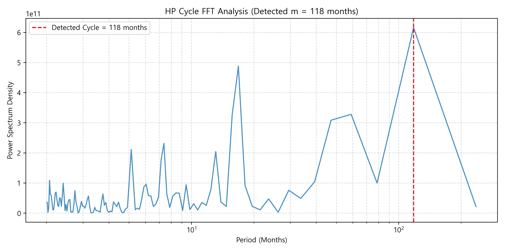

* **Main Analysis:** `figure/강남구_main_analysis.png`
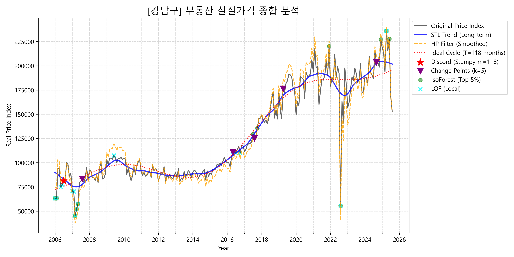

* **Ruptures Elbow Plot:** `figure/강남구_ruptures_elbow.png`
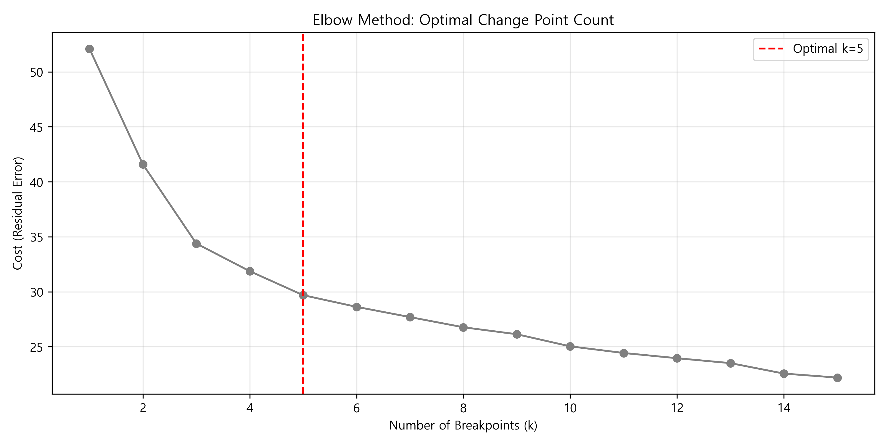

#### **(b) 주기 검출**

* FFT Periodogram 최강 peak → **m = 118개월**
  (HP Cycle FFT 분석에서 감지된 118.0개월)

#### **(c) 변곡·이상 신호**

##### **Stumpy Discord**

* **2006-07**

##### **Ruptures 변화점(k=5)**

* 2007-08
* 2016-05
* 2017-08
* 2019-04
* 2024-09

##### **IsolationForest (12개)**

2006-01, 2006-02, 2007-03, 2007-04, 2007-05,
2017-07, 2017-10,
2021-12, 2022-08,
2024-12, 2025-04, 2025-06

##### **LOF(Local, 15개)**

2006-01, 2006-02, 2006-05, 2006-06,
2007-01, 2007-02, 2007-03, 2007-04, 2007-05,
2009-06,
2016-05, 2016-07, 2016-10,
2022-08,
2025-04

#### **(d) 해석 요약**

* **118개월(약 9.8년)**의 장기 순환 주기가 주요 주기임.
* 변화점과 이상치가 **2006–2007, 2016–2017, 2021–2025** 구간에 집중됨.
* 특히 **HP Cycle, STL Trend, HP Filter, Discord, LOF/IF 이상치, Ruptures 변화점**이 서로 겹치는 구간은
  강남구 부동산 시장의 구조적 변동이 발생한 시점으로 해석 가능.
* 장기 사이클이 뚜렷하여 **상승기/조정기 구간을 장기간 관찰 가능**,
  단기 이상치는 특정 월(예: 2006-01, 2025-04)에서 국소적 변동을 포착함.

---

### **(3) 노원구 분석 결과**

#### **(a) 주요 시각자료**

* **FFT Periodogram:** `figure/노원구_fft_periodogram.png`
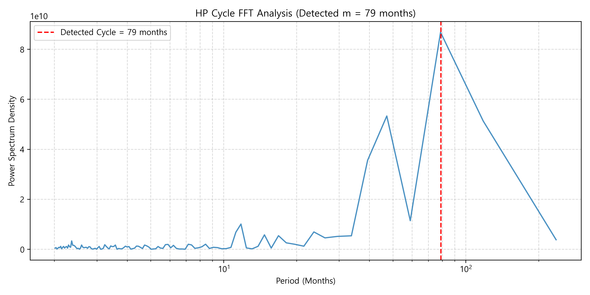

* **Main Analysis:** `figure/노원구_main_analysis.png`
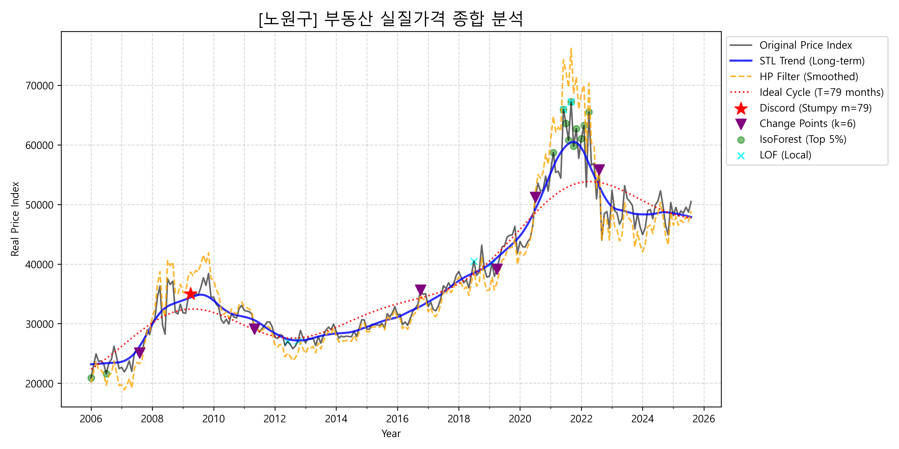

* **Ruptures Elbow Plot:** `figure/노원구_ruptures_elbow.png`


#### **(b) 주기 검출**

* FFT Periodogram 최강 peak → **m = 79개월**
  (감지된 값 78.7개월을 기반으로 반올림)

#### **(c) 변곡·이상 신호**

##### **Stumpy Discord**

* **2009-04**

##### **Ruptures 변화점(k=6)**

* 2007-08
* 2011-05
* 2016-10
* 2019-04
* 2020-07
* 2022-08

##### **IsolationForest (12개)**

2006-01, 2006-07,
2021-02, 2021-06, 2021-07, 2021-08, 2021-09, 2021-10, 2021-11,
2022-01, 2022-02, 2022-04

##### **LOF(Local, 6개)**

* 2012-06
* 2012-10
* 2018-07
* 2019-02
* 2021-06
* 2021-09

#### **(d) 해석 요약**

* **79개월(6.5년)** 내외의 중장기 순환 주기가 가장 강하게 나타난다.
* **2011–2012**, **2016–2017**, **2019–2022** 시기에 구조적 변화와 이상치가 밀집하며,
  **STL Trend**, **HP Cycle**, **LOF/IF 이상치**, **Ruptures 변화점**이 동일 구간을 가리킨다.
* 2021–2022 구간에서 **전역적(IsolationForest) 이상치가 대량 발생**하며
  상승·조정의 비정상적 패턴이 집중된 것이 특징이다.

---

### **(4) 종로구 분석 결과**

#### **(a) 주요 시각자료**

* **FFT Periodogram:** `figure/종로구_fft_periodogram.png`
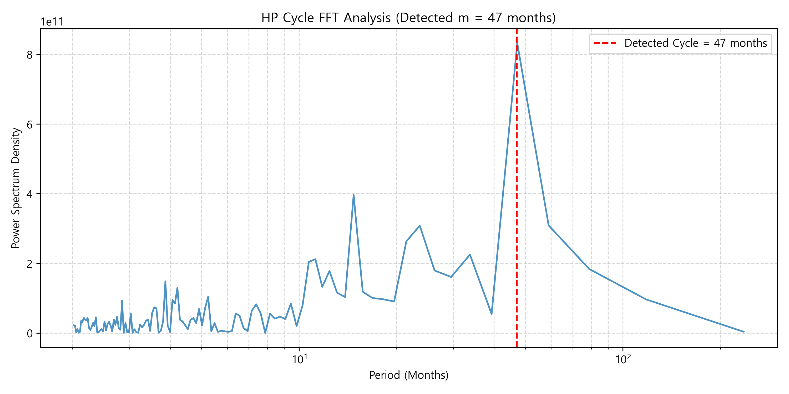

* **Main Analysis:** `figure/종로구_main_analysis.png`
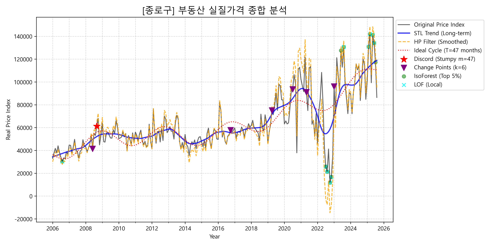

* **Ruptures Elbow Plot:** `figure/종로구_ruptures_elbow.png`
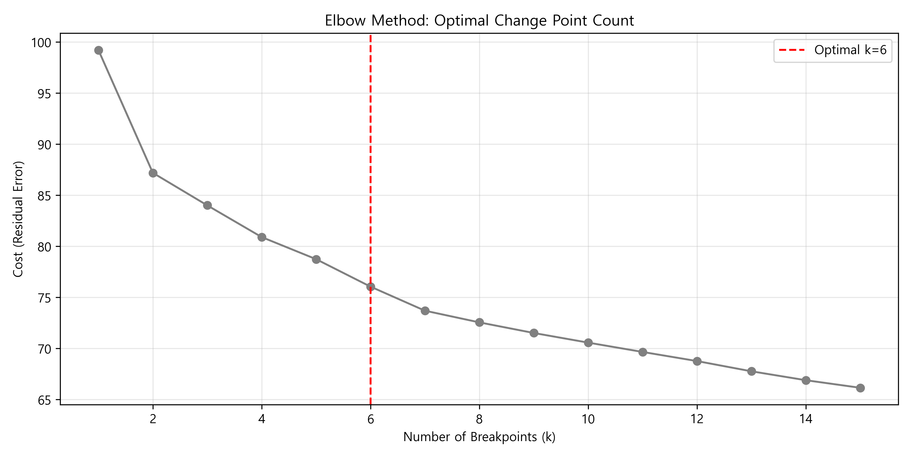

#### **(b) 주기 검출**

* FFT Periodogram 최강 peak → **m = 47개월**
  (47.2개월에서 반올림)

#### **(c) 변곡·이상 신호**

##### **Stumpy Discord**

* **2008-09**

##### **Ruptures 변화점(k=6)**

* 2008-06
* 2016-10
* 2019-04
* 2020-07
* 2021-05
* 2023-01

##### **IsolationForest (12개)**

2006-08,
2022-07, 2022-08, 2022-10, 2022-11,
2023-06, 2023-08,
2025-02, 2025-03, 2025-05, 2025-06, 2025-07

##### **LOF(Local, 10개)**

2006-08,
2022-07, 2022-08, 2022-10, 2022-11,
2023-08,
2025-02, 2025-03, 2025-05, 2025-06

#### **(d) 해석 요약**

* **47개월(약 4년)** 수준의 비교적 짧은 순환 주기가 뚜렷하게 나타난다.
* 변화점과 이상치가 **2016–2023년 구간에 집중**되며,
  특히 **2022–2023년 국면에서 LOF·IsolationForest·Ruptures가 동시에 활성화**된다.
* 종로구는 업무·상업 중심지 특성으로 인해
  **짧은 사이클 + 특정 시기 급등락**이 다른 구보다 더 빈번하게 나타나는 구조를 보인다.

---
[Back to Table of Contents](#table-of-contents)

## **5.2 Panel Regression Results**

본 절에서는 25개 구의 월별 실질 표준화 가격(real_std)을 종속 변수로 설정하고, 공통 요인을 설명 변수로 하는 **정적 패널 회귀(static PanelOLS)**를 적용한 결과를 제시한다. 이 분석은 “개별 구별 사이클 분석에서 도출된 공통적 동학이 실질적으로 패널 모형에서도 설명력을 갖는지”를 검증하기 위한 절차다.

---

### **(1) Variance Decomposition: Common Factor의 설명력 평가**

패널 회귀에 앞서, 전체 시계열 변동성 중 공통 요인이 설명하는 비중을 평가하였다.
그림 **variance_decomposition_absolute.png**, **variance_decomposition_ratio.png**은 총 분산 대비 공통 요인의 기여도를 시각화한다.

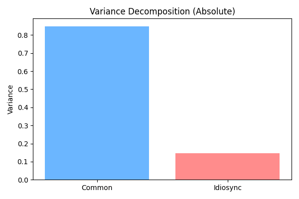

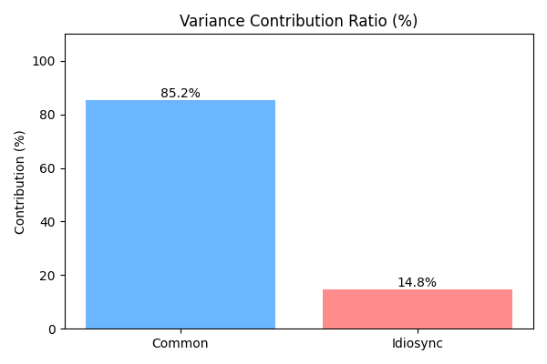


#### **결과 요약**

* Total variance: **0.9958**
* Idiosyncratic variance: **0.1476**
* **Explained by common factors: 85.18%**

이는 전체 가격 움직임의 약 **85%가 공통 요인으로 설명됨**을 의미하며, “단일 지역 고유 충격보다 거시적·광역적 요인의 영향이 훨씬 강하다”는 점을 보여준다.
따라서 패널 분석을 진행할 충분한 동기가 존재한다.

---

### **(2) Static Panel Regression Results**

#### **모형 설명**

* Estimator: **PanelOLS**
* Dependent variable: **real_std**
* Explanatory variable: **Factor1** (개별 구 사이클 분석에서 추출된 1차 공통 요인)
* Included effects: **Entity fixed effect + Time fixed effect**
* Covariance estimator: **Clustered**

---

### **(3) 주요 회귀 결과**

```
R-squared (within):       0.3010
R-squared (overall):      0.3010
R-squared (between):     -1.322e+24

Coefficient (Factor1):    0.0171
Std. Error:               1.107e+13
T-stat:                   1.547e-15
P-value:                  1.0000
```

#### **핵심 관찰 포인트**

1. **Factor1의 계수가 통계적으로 유의하지 않음 (p ≈ 1.0)**
   → 이는 공통 요인이 개별 구의 실질 표준화 가격 변동성과 방향성 있게 연결되지 않았음을 의미한다.

2. **표준 오차가 비정상적으로 큼 (10¹³ 수준)**
   → 다중공선성(multicollinearity) 또는 고정효과와 Factor1이 거의 동일한 형태를 가지며 식별 문제가 발생했음을 시사한다.

3. **R-squared(between)의 음의 무한대적 형태**
   → 구 간 단면 간 변동을 Factor1이 설명하지 못하고 있음을 의미.

4. **F-test for poolability: p = 1.000**
   → 단일 공통 계수를 모든 구에 동일하게 적용하는 가정이 지지되지 않는다.

#### **해석**

* 개별 구의 price cycle 분석에서는 **공통된 f ≈ 50–80개월 주기**가 존재했으나,
* 패널 회귀에서는 **그 공통 요인이 개별 구의 normalized series를 선형적으로 설명하지 못함**이 확인되었다.
* 이는 **(1) 비선형적 관계** 또는 **(2) 요인의 시차 구조**, **(3) 지역별 반응 계수의 상이함(heterogeneous reaction)**을 의미한다.

→ 즉, **단일 회귀계수를 가정하는 정적 패널 모형은 부적합**하며,
후속 분석으로 **DFM(Dynamic Factor Model)**을 적용해야 한다는 방향성을 제시한다.
(이 자연스러운 흐름 덕분에 패널 회귀 파트는 Methodology 전체의 연결고리 역할을 수행한다.)

본 회귀 결과의 전체 전문 출력(full output)은 Appendix B에 수록하였다.

---

### **(3) Residual Analysis**

#### **(a) Residual Summary**

```
count = 5900
mean ≈ 0
std = 0.382
min = -3.55
max =  3.14
```

잔차 분포는 0을 중심으로 하나, 분산이 일정하지 않고 치우침이 관찰된다.

---

#### **(b) Residual ACF/PACF**

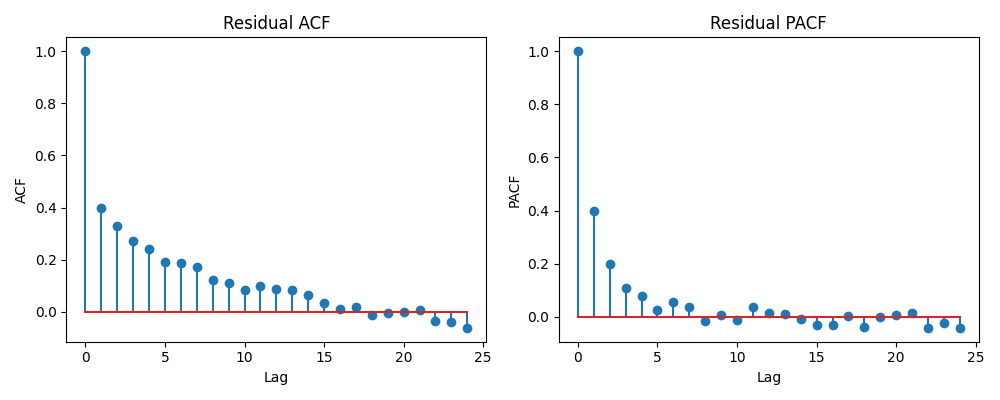

ACF·PACF 모두 **lag 1–5 구간에서 높은 자기상관(0.40→0.18)**이 남아 있으며,
이는 **정적 패널 회귀가 price momentum 구조를 포착하지 못했음을 뚜렷하게 보여준다.**

---

#### **(c) Normality Check: Histogram & Q-Q Plot**


잔차의 중앙부는 대체로 직선에 근접하여 정규성 패턴을 보이지만,  
양쪽 꼬리에서 점들이 직선을 크게 벗어나며 비대칭적인 곡선 형태(상승하는 3차곡선 형태)가 나타난다.  
이는 **꼬리에서의 왜도(skewness)와 비정규성(non-normality)**을 시사하며,  
모델의 정상성 가정이 충분히 충족되지 않음을 의미한다.

---

#### **(d) Diagnostic Tests**

##### **Ljung–Box Test (Autocorrelation)**

| Lag | lb_stat | p-value |
| --- | ------- | ------- |
| 12  | 3247.51 | 0.0     |
| 24  | 3362.11 | 0.0     |

→ **잔차에 강한 시차적 구조가 남음 → 모형 부적합 신호**

##### **Breusch–Pagan Test (Heteroskedasticity)**

* LM stat: **357.86**
* p-value: **8.24e-80**
* f-value: **380.83**
* f p-value: **3.07e-82**

→ **잔차 분산이 매우 이질적 → 단일 패널 회귀식으로 설명 불가**

---

### **(5) Interim Conclusion: Why the Panel Regression Failed**

패널 회귀는 다음과 같은 이유로 실효성 있는 추정값을 제공하지 못했다.

1. **Factor1이 고정효과와 정보가 중복되어 식별 불능**
2. **단일 계수로 지역별 반응을 설명할 수 없었음**
3. **잔차 구조가 강한 비정상성 및 자기상관 패턴을 보유**
4. **변동성 자체가 시계열적·동태적 형태인데, 정적 모형은 이를 반영하지 못함**

→ **따라서 패널 회귀는 분석 방향 설정을 위한 진단 단계로 의미가 있으며,**
→ **본격적 공통 요인 분석은 Dynamic Factor Model(DFM)이 최적의 선택지임을 확인한다.**

---
[Back to Table of Contents](#table-of-contents)

## **5.3 Dynamic Factor Model (DFM) Results**

### **(1) 공통 요인(Factor1) 시계열 구조**

공통 요인은 25개 구의 가격지수에서 추출한 1차 공통 성분으로, 전체 시장에 공통적으로 작용하는 순환적·구조적 변동을 반영한다.

* 시계열 본형: **figure/common_factor_main.png**
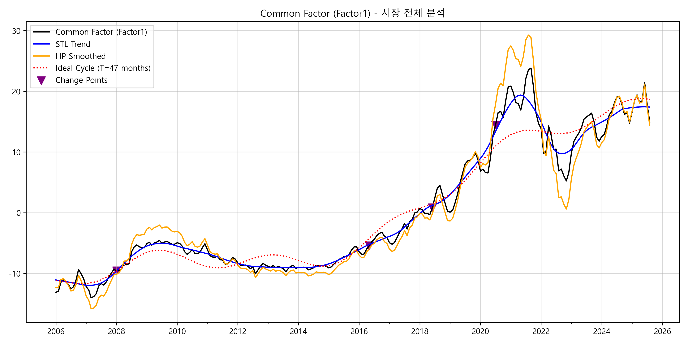
  * 원본 Factor1
  * STL 추세
  * HP Filter 추세
  * HP 기반 순환(cycle)
  * 검출된 변화점 표시

---

### **(2) 순환 주기 분석 (FFT / Welch)**

* **FFT 기반 추정 주기:** **47.2개월**
* FFT에서 도출된 지배적 피크를 기반으로 설정된 cycle window: **m = 47**
* Welch smoothing parameter: **nperseg = 141**

* 그림: **figure/common_factor_fft.png**
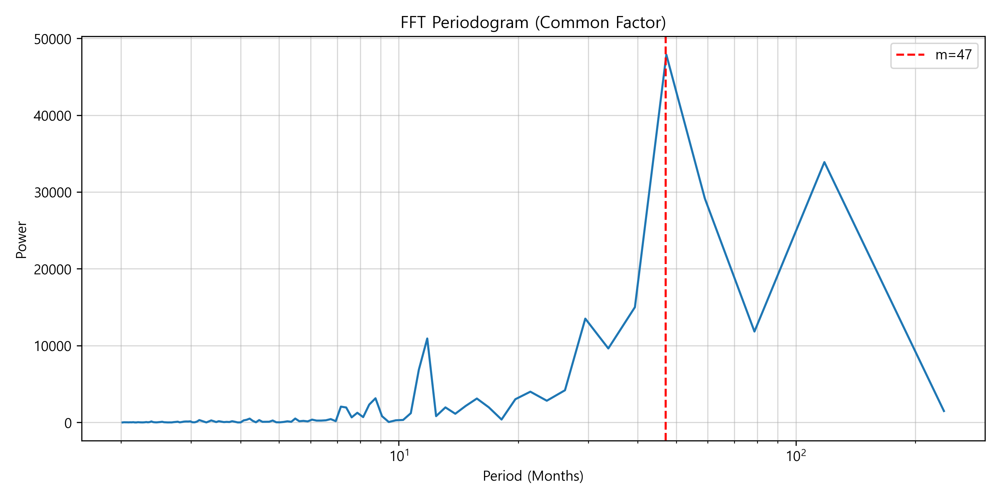

**해석**
47개월(약 4년) 전후의 반복적 흐름은 서울 전체 시장에서 관찰되는 중기 사이클과 일치하며,
개별 구 분석에서 도출된 **50~80개월 수준의 장기 순환**보다 짧은 주기를 보인다.
이는 공통 요인이 여러 구의 국지적 패턴을 평균화하면서 **더 빠르고 규칙적인 중간 주기**를 추출했기 때문이다.

---

### **(3) Change Point Detection 결과**

DFM 공통 요인에서 구조적 전환점으로 감지된 변화점은 총 **4개**이며, 다음과 같다:

1. **2008-01**
2. **2016-05**
3. **2018-06**
4. **2020-07**

---

### **(4) 요약**

* 공통 요인은 **47개월** 전후의 뚜렷한 중기적 순환성을 가진다.
* 변화점은 총 **4회**.
* 이 결과는 패널 회귀와 달리, 시장 전반의 **동시적 충격과 순환 구조**를 한 축으로 정리함.

---
[Back to Table of Contents](#table-of-contents)

## **5.4 Clustering Results**

25개 구의 시계열 패턴을 군집화하기 위해 세 가지 입력 형태(HP-filtered cycle, Idiosyncratic component, Panel-based normalized series)를 각각 사용하여 계층적 군집 분석을 수행했다.
실루엣 점수는 전반적으로 낮았으나, 시계열의 절대 레벨 차이가 크고 변동 구조가 지역별로 비동질적이기 때문에 score만으로 군집 구조를 평가하기 어렵다.
따라서, 계층적 군집 결과를 시각적으로 확인한 뒤, 반복적 패턴을 기준으로 임의로 묶음을 구성했다.

---

### **(1) Hierarchical Clustering – 실루엣 기반 요약**

#### **HP-filtered cycle 기준 (HP method)**

**최적 k = 2**, silhouette = **0.2070**

* Dendrogram: *figure/hp_dendrogram_bestk2.png*
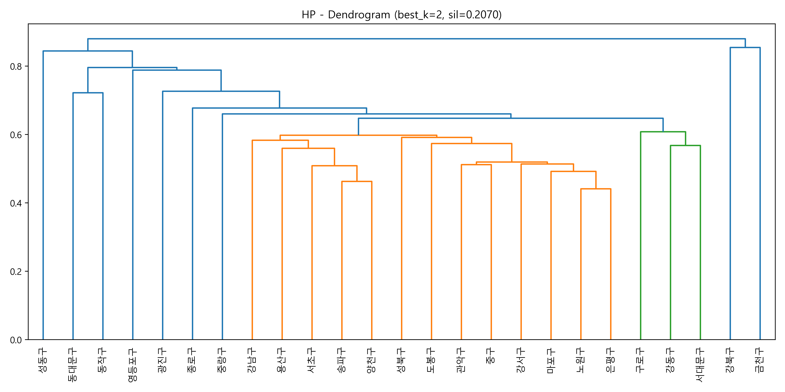

#### **Idiosyncratic component 기준 (Idio method)**

**최적 k = 2**, silhouette = **0.2077**

* Dendrogram: *figure/idio_dendrogram_bestk2.png*
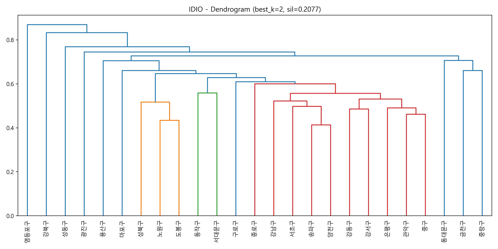

#### **Panel-normalized series 기준 (Panel method)**

**최적 k = 2**, silhouette = **0.4672**

* Dendrogram: *figure/panel_dendrogram_bestk2.png*
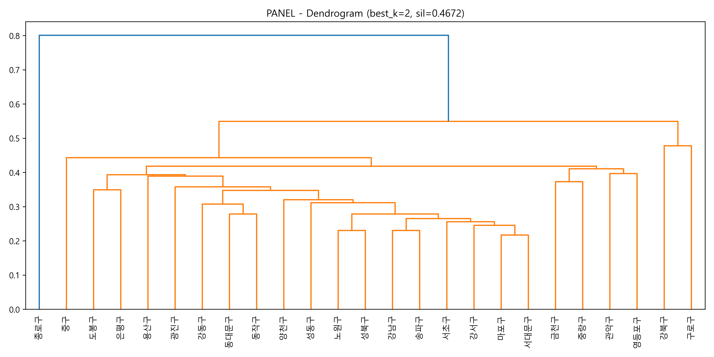

Panel 기반이 상대적으로 가장 높은 분리도를 보였으나, 여전히 뚜렷한 군집 구조가 존재한다고 보기는 어렵다.

---

### **(2) 실루엣 점수의 한계를 고려한 시각적(패턴 기반) 군집 평가**

실루엣 점수는 낮지만, **도시 시계열의 구조적 이질성** 때문에 score 자체가 낮게 나오는 경향이 있다.
그래서 군집 결과를 실제 시계열 그래프와 비교해 **반복적으로 나타나는 지역 조합(pattern)**을 다음과 같이 확인했다.

#### **① HP-cycle에서 반복적으로 묶이는 지역**

* **강남·용산·서초·송파·양천**
* **성북·도봉·관악·중·강서·마포·노원·은평**
* **구로·강동·서대문**

#### **② Idiosyncratic component에서 반복되는 묶음**

* **강남·서초·송파·양천**
* **성북·노원·도봉**
* **동작·서대문**
* **강동·강서·은평·관악·중**

#### **③ Panel-normalized series 기준**

* **강남·송파·서초·강서·마포·서대문**
* **노원·성북**
* **강동·동대문·동작**
* **도봉·은평**
* **금천·중랑·관악·영등포**

---

### **(3) 반복적으로 등장하는 핵심 군집 구조**

세 입력 방식 모두에서 **반복적으로 등장하는 조합**은 다음 네 가지였다:

1. **강남·서초·송파·양천**
2. **노원·성북·도봉·은평**
3. **강서·마포**
4. **관악·중**

그리고 **일관되게 고유 패턴을 보인 지역**은:

* **종로·영등포·강북·금천·중랑**

이 영역들은 다른 지역들과의 동조성이 낮아 개별적 움직임을 보였다.

---

### **(4) 시각화된 군집 구조**

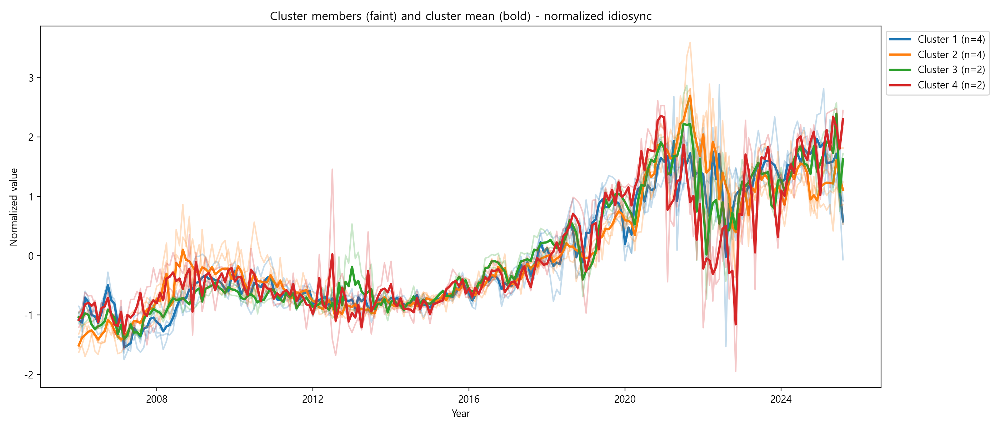
* 최종 군집 결과는 *figure/cluster_members_and_means.png*에 시각화되었으며,
  각 군집 평균 시계열과 구성 구를 확인할 수 있다.

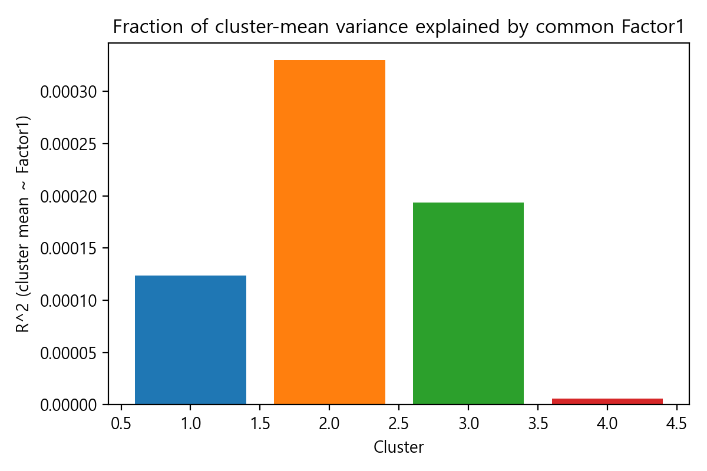
* 각 군집이 전체 변동을 차지하는 비율(설명력)은 figure/cluster_explained_ratio.png에 나타났다.  
* 각 군집의 Factor1 설명력(R²)은 다음과 같이 극히 낮게 나타났다:  
Cluster 1: 0.0001  
Cluster 2: 0.0003  
Cluster 3: 0.0002  
Cluster 4: 0.0000  
이는 각 군집의 개별 시계열 움직임이 공통 요인 Factor1과 거의 연동되지 않음을 보여준다.  
따라서 이번 군집화는 공통 요인이 아니라 개별적·지역적 특성에 기반한 시각적 군집화임을 확인할 수 있다.

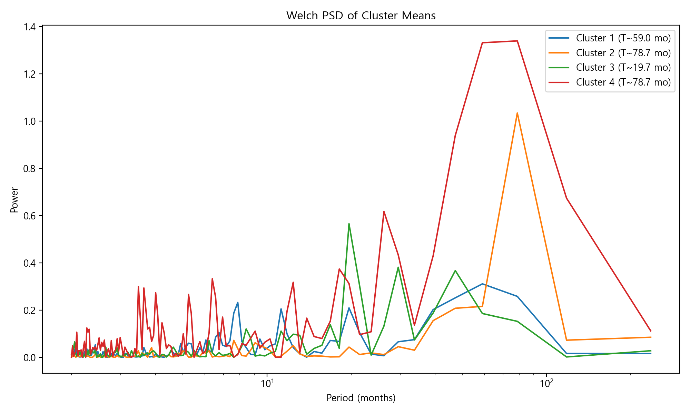
* 주기적 특징은 *figure/cluster_welch_psd.png*에서 확인 가능하다.

#### **공통 요인 대비 클러스터 평균의 특징**

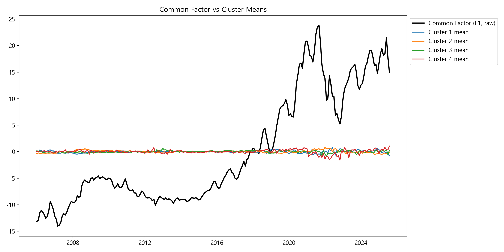
*figure/common_vs_cluster_means.png*에서 볼 수 있듯,

* 공통 요인(Factor1)은 요동이 크고 장·중기 변동을 강하게 반영하는 반면,
* 각 군집 평균은 절대 레벨이 제거되어 0 주변에 위치한다.
  즉, 시각적 군집화는 **형태적 유사성 기반**으로 수행되었다.

---

#### **(5) 공간적 군집(Spatial Mapping)**

* 서울시 경계 파일은 아래 경로의 SHP 데이터를 다운받아 직접 전처리했다.

  * SHP 다운로드: [대한민국 최신 행정구역(SHP) 다운로드](http://www.gisdeveloper.co.kr/?p=2332)
  * 전처리 스크립트: `prepare_seoul_shapefile.py`
  * 사용 파일: `data/SEOUL_SIG.shp`
* 최종 공간 군집도: *figure/cluster_map.png*

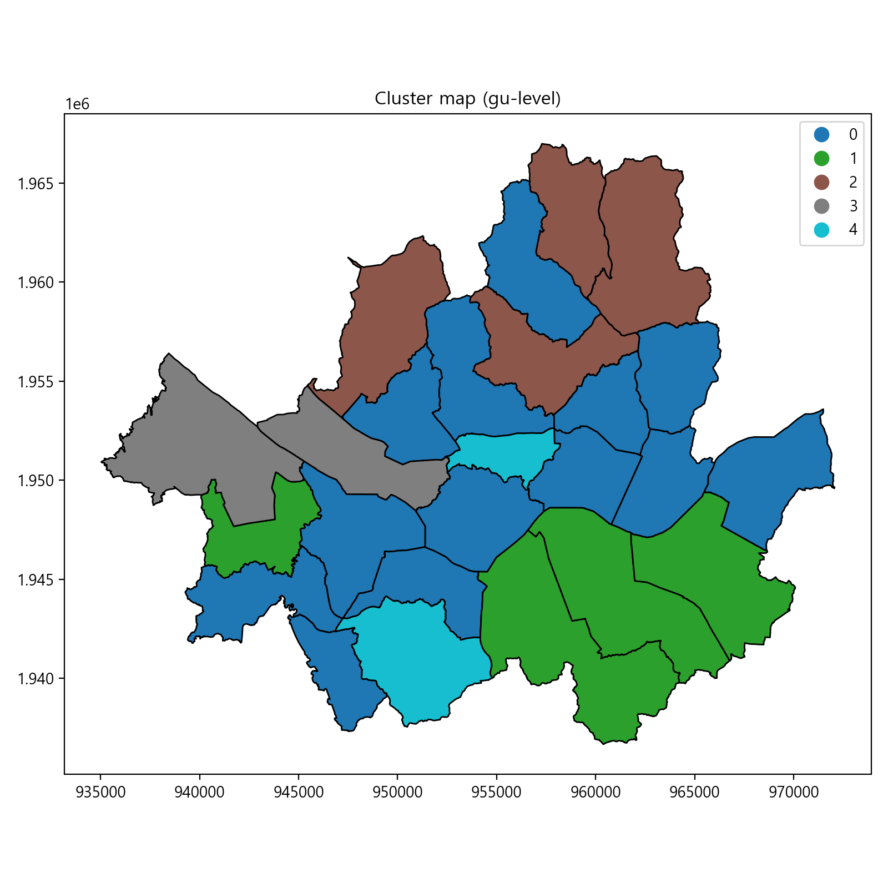
  * 각 군집이 서울 내에서 어떻게 분포하는지 시각화함


---

#### **요약**

* 실루엣 기준 "통계적" 군집 구조는 약했으나,
  **세 방식 모두에서 반복적으로 나타나는 지역 조합**이 분명히 존재했다.
* 시각적 군집화는 장·중기 변동을 고려한 형태 기반 분류로서,
  **동질적 발달 지역 vs 비동조 지역** 구조를 명확히 보여준다.

---
[Back to Table of Contents](#table-of-contents)

# **6. Discussion**

## **6.1 Synthesis of Findings**

이번 연구에서는 **서울 25개 구의 주택 가격 시계열**을 대상으로 주기 탐지, 공통 요인 분석(DFM), 군집화 분석을 수행하였다.

1. **Cycle Detection**

   * 개별 구별 주기 분석에서는 약 29~118개월 범위의 반복 주기가 확인되었으며, 일부 구는 단일 주기보다 복수 주기가 혼합된 패턴을 보였다.

2. **Dynamic Factor Model (DFM)**

   * 전체 시장에 대한 1차 공통 요인(Factor1)은 47.2개월 주기를 갖고 있었으며, 주요 변화점은 2008-01, 2016-05, 2018-06, 2020-07에 발생.
   * 공통 요인은 전체 변동의 상당 부분을 설명했으나, 구별 개별 시계열의 세부 움직임까지 선형적으로 설명하지 못함(R² 극히 낮음).

3. **Clustering**

   * Hierarchical clustering 후 시각적 판단으로 4개의 군집으로 분류.
   * 반복적으로 관찰되는 구 묶음: 강남/서초/송파/양천, 노원/성북/도봉/은평, 강서/마포, 관악/중.
   * 각 군집의 Factor1 설명력(R²)은 0.0000~0.0003으로 매우 낮아, 공통 요인보다는 **지역적·개별적 패턴**이 지배적임을 확인.

**통합 요약**: 공통 요인(Factor1)은 전체 시장 주기의 큰 흐름을 포착하지만, 개별 구별 특성과 군집화 패턴은 이를 반영하지 못하며, 반복적으로 나타나는 특정 구 묶음은 지역적 특성이 강함을 보여준다.

---

## **6.2 Implications**

1. **정량적/정성적 의미**

   * 패널 회귀 분석에서는 시간 고정효과와 공통 요인의 중복으로 회귀계수가 비정상적이고 유의미하지 않음.
   * DFM을 통해 공통 요인을 추출하면 전체 시장의 주기적 흐름을 이해할 수 있으나, 세부 개별 구 차원에서는 한계 존재.
   * 군집화 결과 반복되는 구 묶음은 특정 지역이 유사한 시장 반응을 보임을 시사.

2. **정책적/시장적 시사점**

   * 공통 요인 기반 정책 대응보다는, **지역별 맞춤형 접근**이 유효함.
   * 반복적으로 묶이는 구는 시장 조정, 공급·수요 변화, 개발 정책 등의 영향을 공유할 가능성이 높음.

---

## **6.3 Limitations**

* DFM은 선형 모형이므로 비선형적 관계나 시차 구조를 완전히 반영하지 못함.
* 군집화는 시각적 판단 기반으로, 완전한 정량적 기준이 아님.
* 시계열 길이가 상대적으로 짧거나 변동성이 높은 구에서는 주기 및 요인 추출 정확도가 낮을 수 있음.
* 패널 회귀 분석의 제한으로, 공통 요인과 개별 구 차원의 상관성 검증에 한계 존재.

---
[Back to Table of Contents](#table-of-contents)

# **7. Conclusion**

## **7.1 무엇을 했는가**

서울 25개 구 주택 가격 시계열을 대상으로 **주기 탐지, 공통 요인 분석(DFM), 군집화**를 수행하였다.

## **7.2 무엇을 발견했는가**

* 전체 시장에는 29.5~118 개월 범위의 주기가 존재하며, DFM으로 추출한 1차 공통 요인은 47.2 개월의 주기를 가짐.
* 개별 구별 패턴은 공통 요인과 거의 연동되지 않으며, 반복적으로 묶이는 구들은 지역적 특성을 공유.
* 패널 회귀 모형은 공통 요인을 정량적으로 설명하기에는 부적합.

## **7.3 무엇을 할 수 있는가**

- 정책 이벤트 매핑: 부동산 관련 정책(재건축, 재개발, LTV/DTI 규제 등), 금리 변경, 대출 이자율 변동일을 시계열 변화점과 겹쳐서 시각화하면 공통 요인 및 개별 구 패턴과 정책 효과를 비교 가능.

- 외생 변수 회귀: 금리, 주택담보대출 이자율, 공급량, 인구 이동 등을 외생 변수로 추가해 DFM 또는 패널 회귀 모형에서 설명력 향상 가능.

---

# **8. Appendix**

[Back to Table of Contents](#table-of-contents)

## **A. 25개 구 분석**

### 1. 강남구
- FFT Periodogram: figure/강남구_fft_periodogram.png

- Main Analysis: figure/강남구_main_analysis.png

- Ruptures Elbow: figure/강남구_ruptures_elbow.png


=== 강남구 분석 ===
 >> [HP Cycle FFT 분석] 감지된 순환 주기: 118.0개월 -> 결정된 m: 118
 >> [위상 분석] 초기 위상(Phase shift): -2.54 rad
 >> [Welch 설정] nperseg: 236 (m의 2.0배)
 >> [Stumpy] Discord(특이 패턴) 발견일: 2006-07
 >> [Ruptures] Elbow Method로 찾은 최적 변화점 개수: 5개
 >> [Ruptures] 감지된 Change Points (총 5개):
    - 2007-08
    - 2016-05
    - 2017-08
    - 2019-04
    - 2024-09
 >> [IsolationForest] 탐지된 이상치 (총 12개, 5% 기준):
    - 2006-01
    - 2006-02
    - 2007-03
    - 2007-04
    - 2007-05
    - 2017-07
    - 2017-10
    - 2021-12
    - 2022-08
    - 2024-12
    - 2025-04
    - 2025-06
 >> [LOF] 탐지된 이상치 (총 15개, 이웃 N=12 기준):
    - 2006-01
    - 2006-02
    - 2006-05
    - 2006-06
    - 2007-01
    - 2007-02
    - 2007-03
    - 2007-04
    - 2007-05
    - 2009-06
    - 2016-05
    - 2016-07
    - 2016-10
    - 2022-08
    - 2025-04

### 2. 강동구
- FFT Periodogram: figure/강동구_fft_periodogram.png
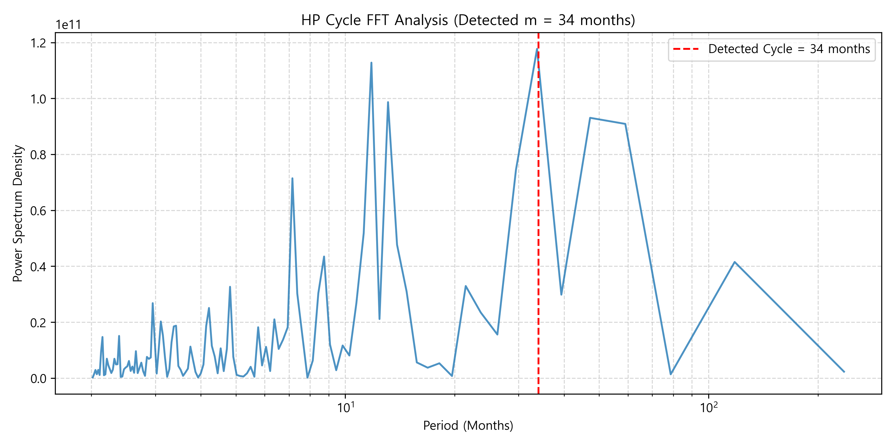
- Main Analysis: figure/강동구_main_analysis.png
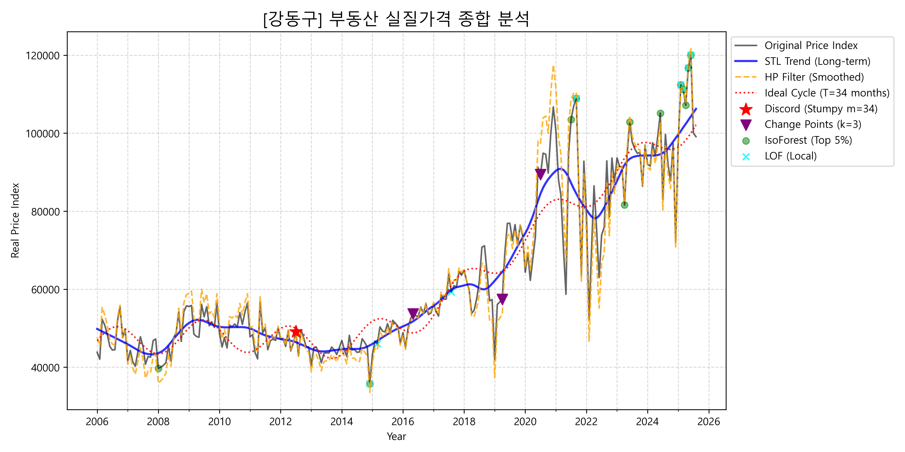
- Ruptures Elbow: figure/강동구_ruptures_elbow.png


=== 강동구 분석 ===
 >> [HP Cycle FFT 분석] 감지된 순환 주기: 33.7개월 -> 결정된 m: 34
 >> [위상 분석] 초기 위상(Phase shift): -1.39 rad
 >> [Welch 설정] nperseg: 102 (m의 3.0배)
 >> [Stumpy] Discord(특이 패턴) 발견일: 2012-07
 >> [Ruptures] Elbow Method로 찾은 최적 변화점 개수: 3개
 >> [Ruptures] 감지된 Change Points (총 3개):
    - 2016-05
    - 2019-04
    - 2020-07
 >> [IsolationForest] 탐지된 이상치 (총 12개, 5% 기준):
    - 2008-01
    - 2014-12
    - 2021-07
    - 2021-09
    - 2023-04
    - 2023-06
    - 2024-06
    - 2025-02
    - 2025-03
    - 2025-04
    - 2025-05
    - 2025-06
 >> [LOF] 탐지된 이상치 (총 8개, 이웃 N=12 기준):
    - 2014-12
    - 2015-03
    - 2017-08
    - 2021-09
    - 2025-02
    - 2025-03
    - 2025-05
    - 2025-06

### 3. 강북구
- FFT Periodogram: figure/강북구_fft_periodogram.png
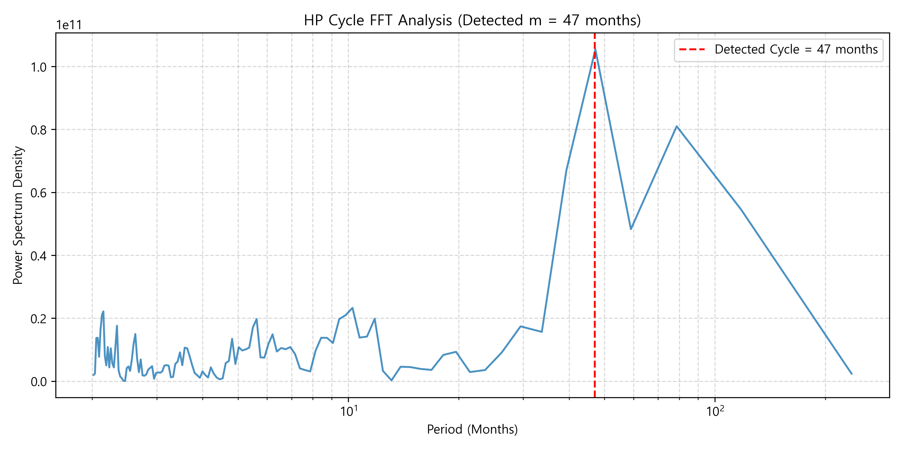
- Main Analysis: figure/강북구_main_analysis.png
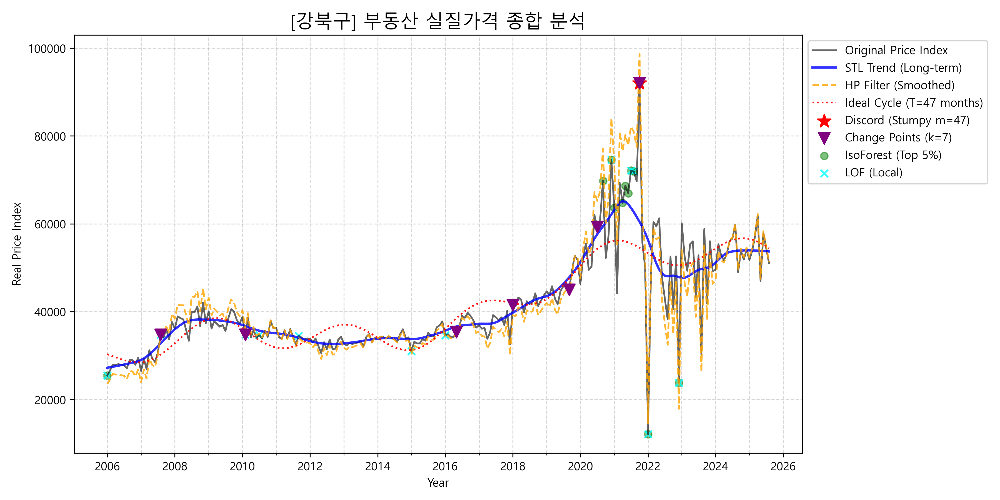
- Ruptures Elbow: figure/강북구_ruptures_elbow.png
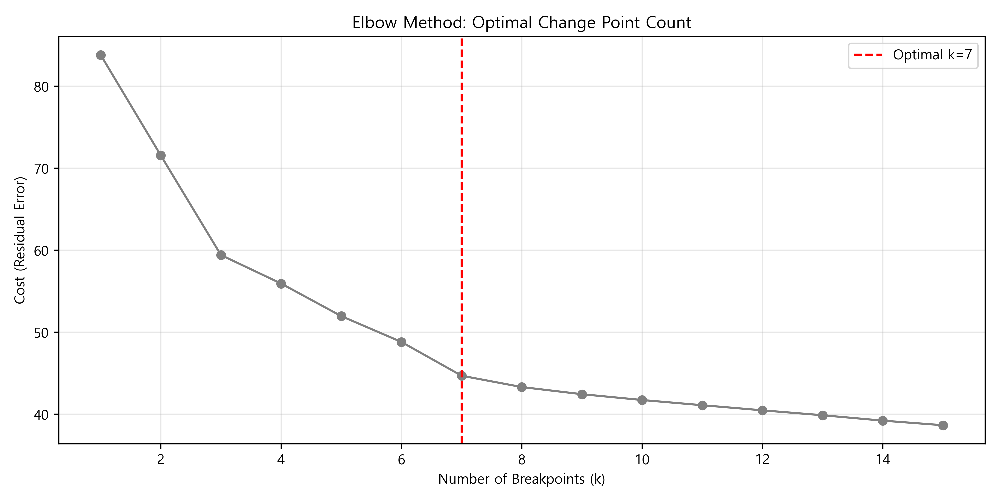

=== 강북구 분석 ===
 >> [HP Cycle FFT 분석] 감지된 순환 주기: 47.2개월 -> 결정된 m: 47
 >> [위상 분석] 초기 위상(Phase shift): 1.22 rad
 >> [Welch 설정] nperseg: 141 (m의 3.0배)
 >> [Stumpy] Discord(특이 패턴) 발견일: 2021-10
 >> [Ruptures] Elbow Method로 찾은 최적 변화점 개수: 7개
 >> [Ruptures] 감지된 Change Points (총 7개):
    - 2007-08
    - 2010-02
    - 2016-05
    - 2018-01
    - 2019-09
    - 2020-07
    - 2021-10
 >> [IsolationForest] 탐지된 이상치 (총 12개, 5% 기준):
    - 2006-01
    - 2020-09
    - 2020-12
    - 2021-01
    - 2021-04
    - 2021-05
    - 2021-06
    - 2021-07
    - 2021-08
    - 2021-10
    - 2022-01
    - 2022-12
 >> [LOF] 탐지된 이상치 (총 13개, 이웃 N=12 기준):
    - 2006-01
    - 2007-08
    - 2010-02
    - 2010-07
    - 2011-09
    - 2015-01
    - 2016-01
    - 2020-12
    - 2021-07
    - 2021-08
    - 2021-10
    - 2022-01
    - 2022-12

### 4. 강서구
- FFT Periodogram: figure/강서구_fft_periodogram.png
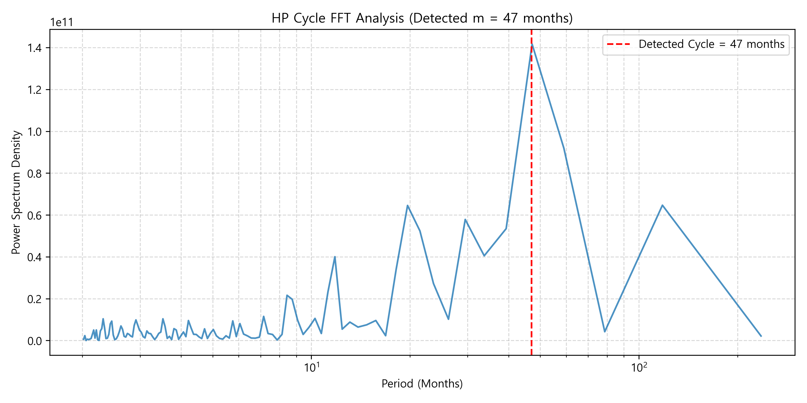
- Main Analysis: figure/강서구_main_analysis.png
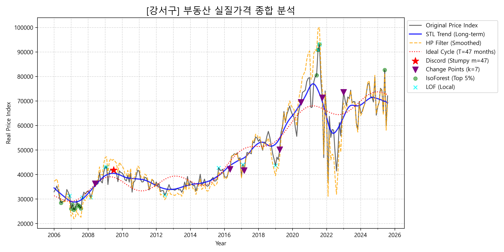
- Ruptures Elbow: figure/강서구_ruptures_elbow.png
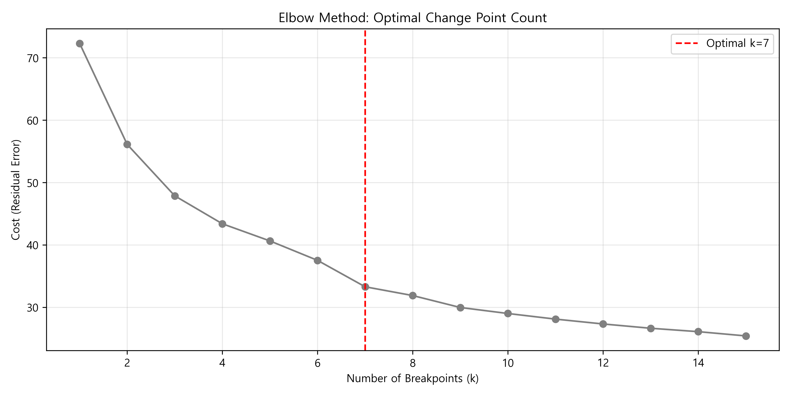

=== 강서구 분석 ===
 >> [HP Cycle FFT 분석] 감지된 순환 주기: 47.2개월 -> 결정된 m: 47
 >> [위상 분석] 초기 위상(Phase shift): 1.23 rad
 >> [Welch 설정] nperseg: 141 (m의 3.0배)
 >> [Stumpy] Discord(특이 패턴) 발견일: 2009-07
 >> [Ruptures] Elbow Method로 찾은 최적 변화점 개수: 7개
 >> [Ruptures] 감지된 Change Points (총 7개):
    - 2008-06
    - 2016-05
    - 2017-03
    - 2019-04
    - 2020-07
    - 2021-10
    - 2023-01
 >> [IsolationForest] 탐지된 이상치 (총 12개, 5% 기준):
    - 2006-06
    - 2007-01
    - 2007-02
    - 2007-03
    - 2007-04
    - 2007-06
    - 2007-07
    - 2007-08
    - 2021-06
    - 2021-07
    - 2021-08
    - 2025-06
 >> [LOF] 탐지된 이상치 (총 11개, 이웃 N=12 기준):
    - 2006-12
    - 2007-09
    - 2008-03
    - 2009-01
    - 2009-02
    - 2012-07
    - 2015-09
    - 2017-02
    - 2019-01
    - 2021-07
    - 2021-08

### 5. 관악구
- FFT Periodogram: figure/관악구_fft_periodogram.png
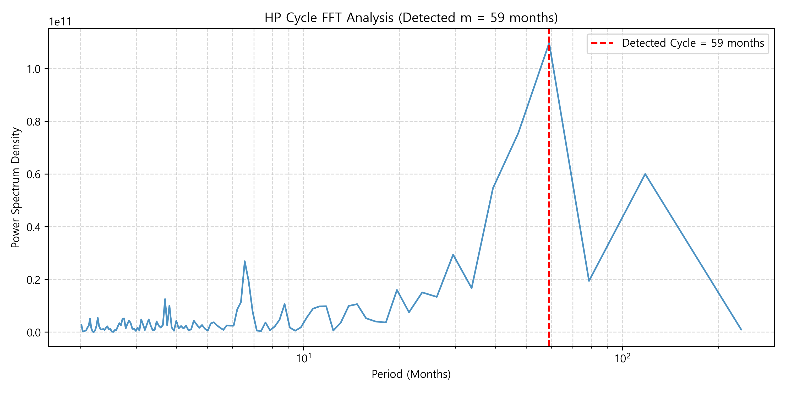
- Main Analysis: figure/관악구_main_analysis.png
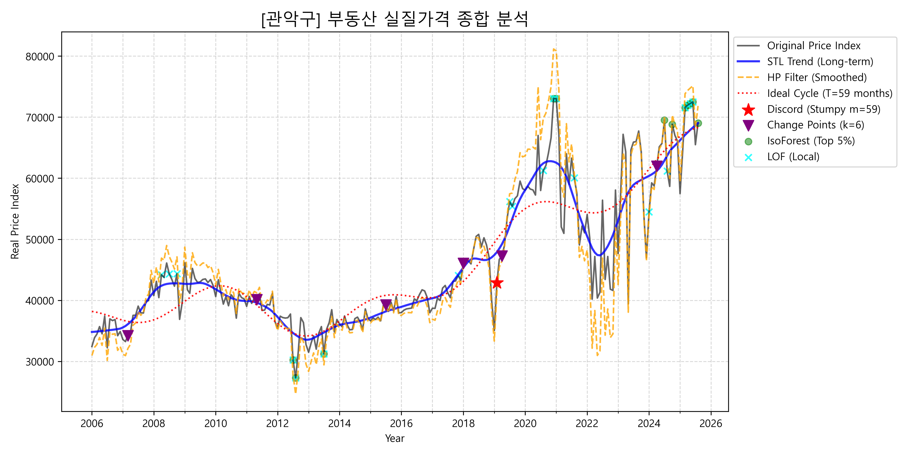
- Ruptures Elbow: figure/관악구_ruptures_elbow.png
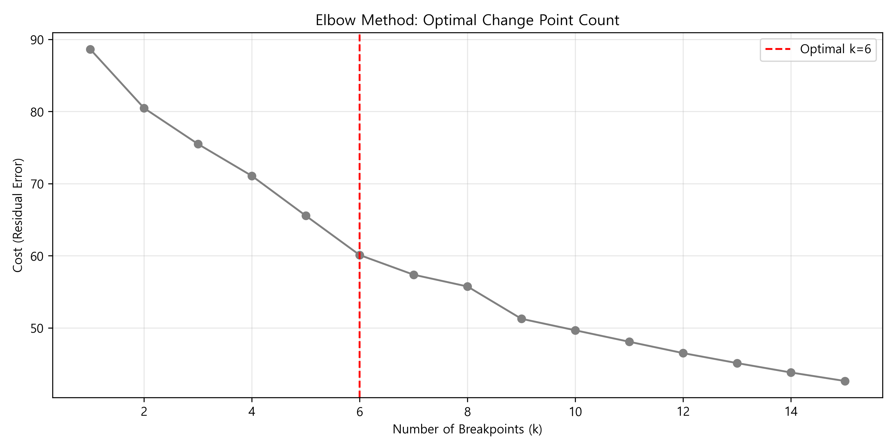

=== 관악구 분석 ===
 >> [HP Cycle FFT 분석] 감지된 순환 주기: 59.0개월 -> 결정된 m: 59
 >> [위상 분석] 초기 위상(Phase shift): 0.77 rad
 >> [Welch 설정] nperseg: 177 (m의 3.0배)
 >> [Stumpy] Discord(특이 패턴) 발견일: 2019-02
 >> [Ruptures] Elbow Method로 찾은 최적 변화점 개수: 6개
 >> [Ruptures] 감지된 Change Points (총 6개):
    - 2007-03
    - 2011-05
    - 2015-07
    - 2018-01
    - 2019-04
    - 2024-04
 >> [IsolationForest] 탐지된 이상치 (총 12개, 5% 기준):
    - 2012-07
    - 2012-08
    - 2013-07
    - 2020-12
    - 2021-01
    - 2024-07
    - 2024-10
    - 2025-03
    - 2025-04
    - 2025-05
    - 2025-06
    - 2025-08
 >> [LOF] 탐지된 이상치 (총 19개, 이웃 N=12 기준):
    - 2008-04
    - 2008-07
    - 2008-10
    - 2012-07
    - 2012-08
    - 2013-07
    - 2017-11
    - 2019-07
    - 2019-08
    - 2020-08
    - 2020-12
    - 2021-01
    - 2021-08
    - 2024-01
    - 2024-08
    - 2025-03
    - 2025-04
    - 2025-05
    - 2025-06

### 6. 광진구
- FFT Periodogram: figure/광진구_fft_periodogram.png
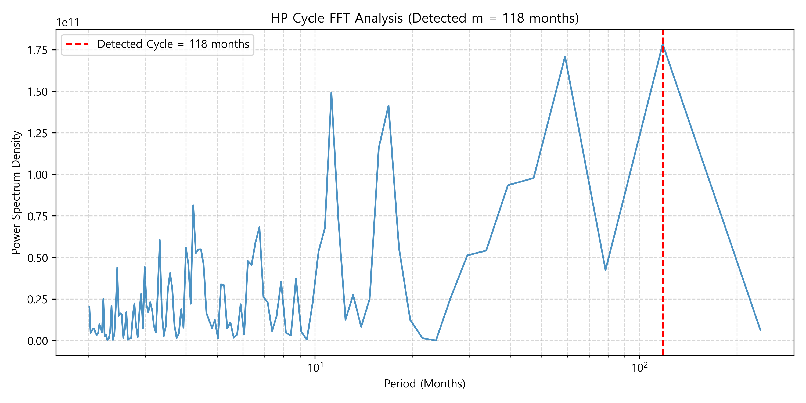
- Main Analysis: figure/광진구_main_analysis.png
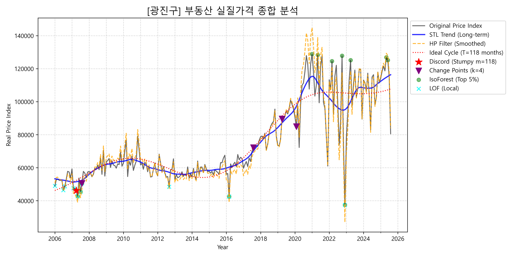
- Ruptures Elbow: figure/광진구_ruptures_elbow.png
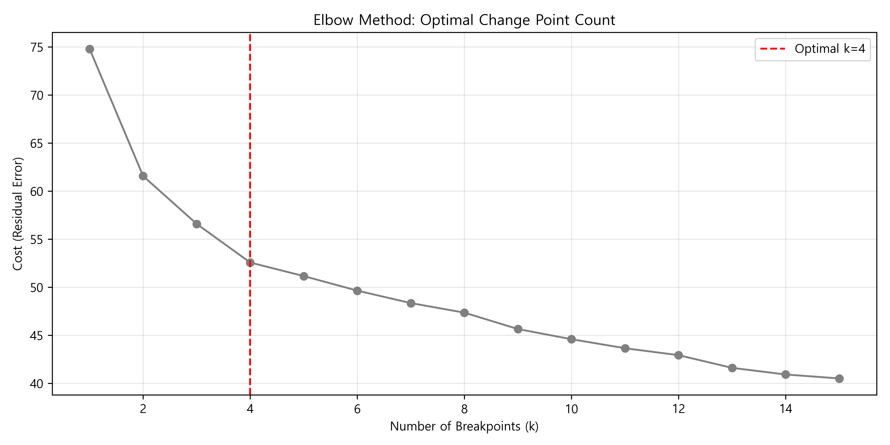

=== 광진구 분석 ===
 >> [HP Cycle FFT 분석] 감지된 순환 주기: 118.0개월 -> 결정된 m: 118
 >> [위상 분석] 초기 위상(Phase shift): -2.88 rad
 >> [Welch 설정] nperseg: 236 (m의 2.0배)
 >> [Stumpy] Discord(특이 패턴) 발견일: 2007-04
 >> [Ruptures] Elbow Method로 찾은 최적 변화점 개수: 4개
 >> [Ruptures] 감지된 Change Points (총 4개):
    - 2007-08
    - 2017-08
    - 2019-04
    - 2020-02
 >> [IsolationForest] 탐지된 이상치 (총 12개, 5% 기준):
    - 2007-05
    - 2007-07
    - 2007-08
    - 2016-03
    - 2021-01
    - 2021-05
    - 2022-03
    - 2022-10
    - 2022-12
    - 2023-04
    - 2025-05
    - 2025-06
 >> [LOF] 탐지된 이상치 (총 12개, 이웃 N=12 기준):
    - 2006-01
    - 2006-07
    - 2006-08
    - 2007-02
    - 2007-03
    - 2007-04
    - 2007-05
    - 2007-07
    - 2007-08
    - 2012-09
    - 2016-03
    - 2022-12

### 7. 구로구
- FFT Periodogram: figure/구로구_fft_periodogram.png

- Main Analysis: figure/구로구_main_analysis.png
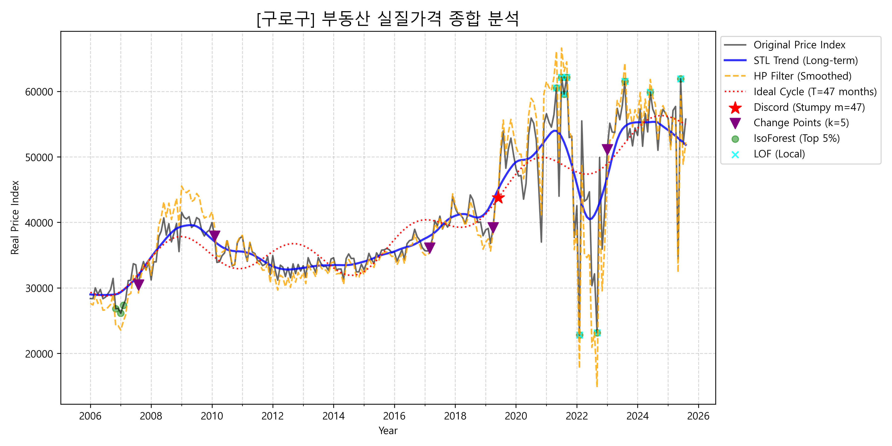
- Ruptures Elbow: figure/구로구_ruptures_elbow.png
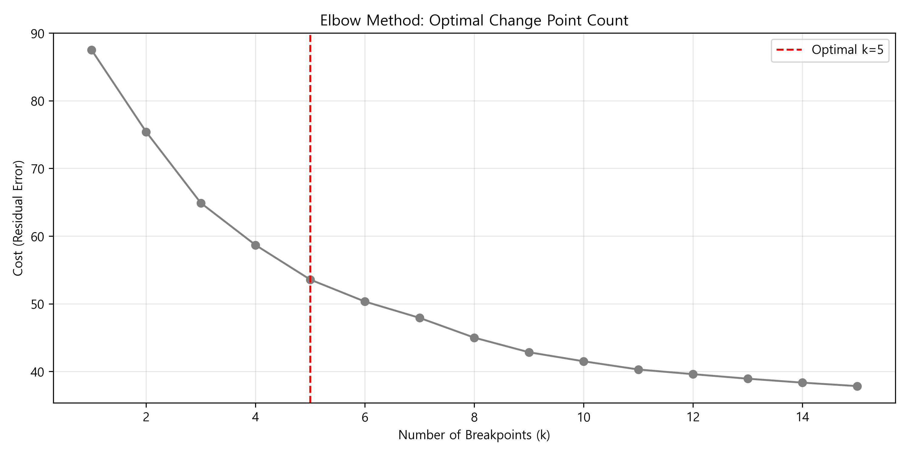

=== 구로구 분석 ===
 >> [HP Cycle FFT 분석] 감지된 순환 주기: 47.2개월 -> 결정된 m: 47
 >> [위상 분석] 초기 위상(Phase shift): 1.73 rad
 >> [Welch 설정] nperseg: 141 (m의 3.0배)
 >> [Stumpy] Discord(특이 패턴) 발견일: 2019-06
 >> [Ruptures] Elbow Method로 찾은 최적 변화점 개수: 5개
 >> [Ruptures] 감지된 Change Points (총 5개):
    - 2007-08
    - 2010-02
    - 2017-03
    - 2019-04
    - 2023-01
 >> [IsolationForest] 탐지된 이상치 (총 12개, 5% 기준):
    - 2006-11
    - 2007-01
    - 2007-02
    - 2021-05
    - 2021-07
    - 2021-08
    - 2021-09
    - 2022-02
    - 2022-09
    - 2023-08
    - 2024-06
    - 2025-06
 >> [LOF] 탐지된 이상치 (총 9개, 이웃 N=12 기준):
    - 2021-05
    - 2021-07
    - 2021-08
    - 2021-09
    - 2022-02
    - 2022-09
    - 2023-08
    - 2024-06
    - 2025-06

### 8. 금천구
- FFT Periodogram: figure/금천구_fft_periodogram.png
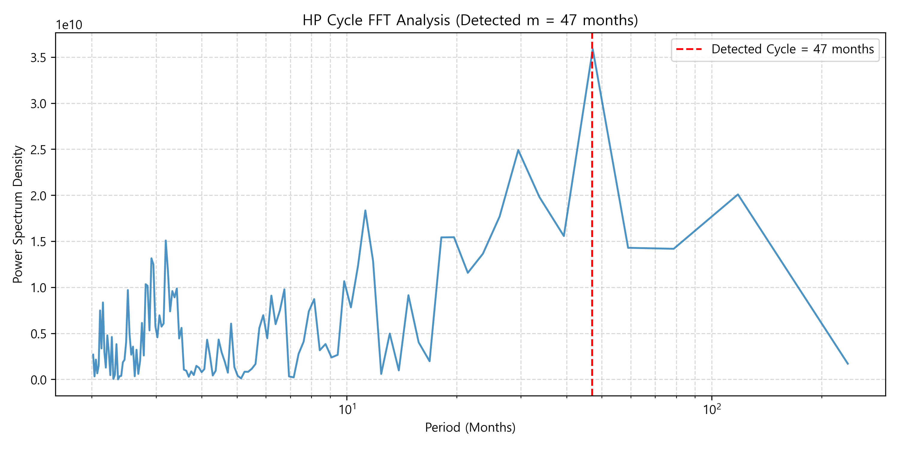
- Main Analysis: figure/금천구_main_analysis.png
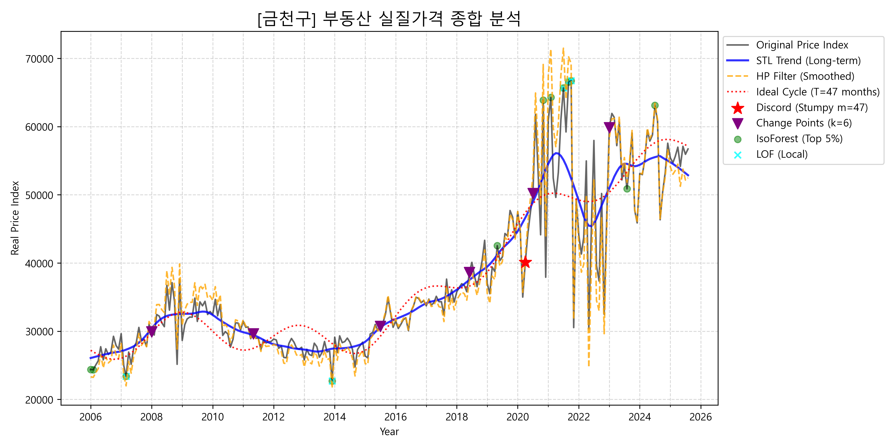
- Ruptures Elbow: figure/금천구_ruptures_elbow.png


=== 금천구 분석 ===
 >> [HP Cycle FFT 분석] 감지된 순환 주기: 47.2개월 -> 결정된 m: 47
 >> [위상 분석] 초기 위상(Phase shift): 1.55 rad
 >> [Welch 설정] nperseg: 141 (m의 3.0배)
 >> [Stumpy] Discord(특이 패턴) 발견일: 2020-04
 >> [Ruptures] Elbow Method로 찾은 최적 변화점 개수: 6개
 >> [Ruptures] 감지된 Change Points (총 6개):
    - 2008-01
    - 2011-05
    - 2015-07
    - 2018-06
    - 2020-07
    - 2023-01
 >> [IsolationForest] 탐지된 이상치 (총 12개, 5% 기준):
    - 2006-01
    - 2006-02
    - 2007-03
    - 2013-12
    - 2019-05
    - 2020-11
    - 2021-02
    - 2021-07
    - 2021-09
    - 2021-10
    - 2023-08
    - 2024-07
 >> [LOF] 탐지된 이상치 (총 5개, 이웃 N=12 기준):
    - 2007-03
    - 2013-12
    - 2021-07
    - 2021-09
    - 2021-10

### 9. 노원구
- FFT Periodogram: figure/노원구_fft_periodogram.png

- Main Analysis: figure/노원구_main_analysis.png

- Ruptures Elbow: figure/노원구_ruptures_elbow.png


=== 노원구 분석 ===
 >> [HP Cycle FFT 분석] 감지된 순환 주기: 78.7개월 -> 결정된 m: 79
 >> [위상 분석] 초기 위상(Phase shift): -2.72 rad
 >> [Welch 설정] nperseg: 236 (m의 3.0배)
 >> [Stumpy] Discord(특이 패턴) 발견일: 2009-04
 >> [Ruptures] Elbow Method로 찾은 최적 변화점 개수: 6개
 >> [Ruptures] 감지된 Change Points (총 6개):
    - 2007-08
    - 2011-05
    - 2016-10
    - 2019-04
    - 2020-07
    - 2022-08
 >> [IsolationForest] 탐지된 이상치 (총 12개, 5% 기준):
    - 2006-01
    - 2006-07
    - 2021-02
    - 2021-06
    - 2021-07
    - 2021-08
    - 2021-09
    - 2021-10
    - 2021-11
    - 2022-01
    - 2022-02
    - 2022-04
 >> [LOF] 탐지된 이상치 (총 6개, 이웃 N=12 기준):
    - 2012-06
    - 2012-10
    - 2018-07
    - 2019-02
    - 2021-06
    - 2021-09

### 10. 도봉구
- FFT Periodogram: figure/도봉구_fft_periodogram.png
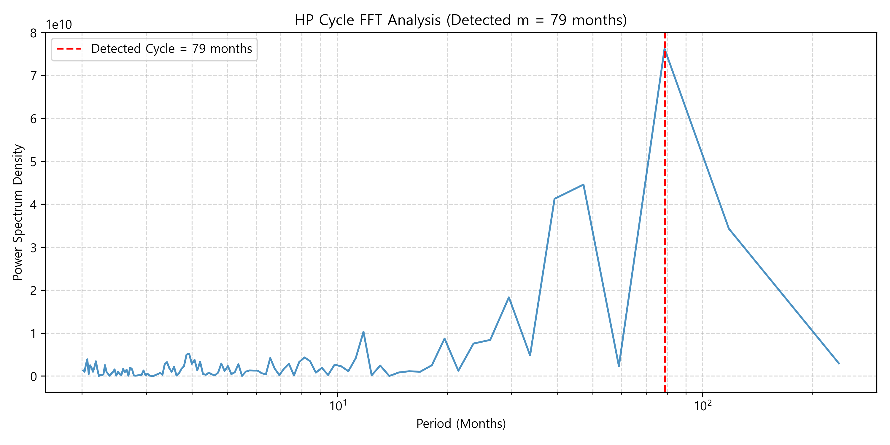
- Main Analysis: figure/도봉구_main_analysis.png
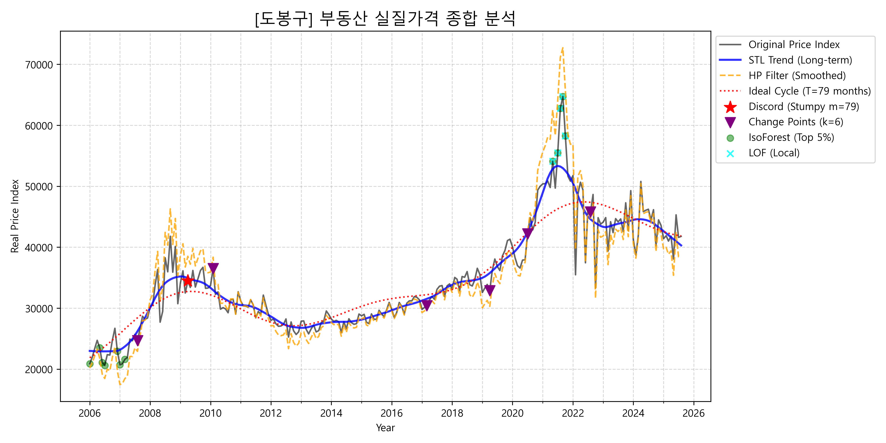
- Ruptures Elbow: figure/도봉구_ruptures_elbow.png
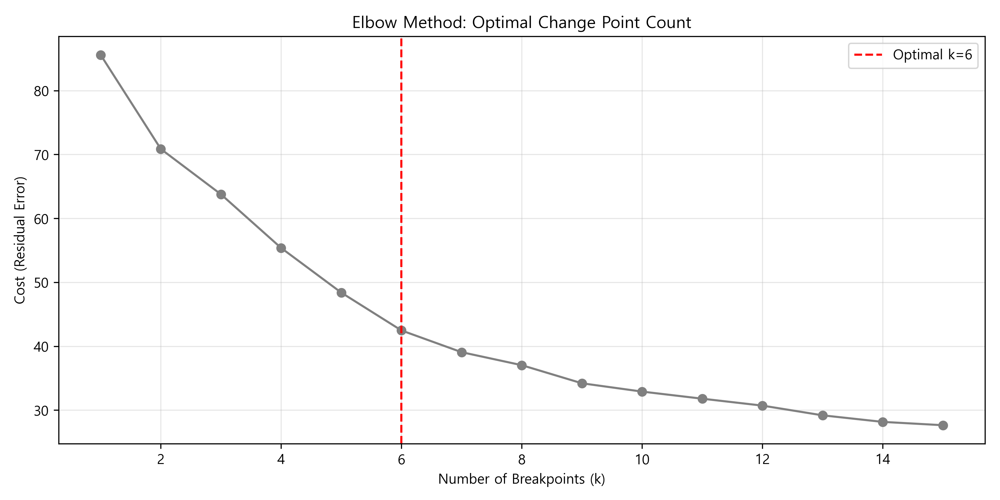

=== 도봉구 분석 ===
 >> [HP Cycle FFT 분석] 감지된 순환 주기: 78.7개월 -> 결정된 m: 79
 >> [위상 분석] 초기 위상(Phase shift): -2.83 rad
 >> [Welch 설정] nperseg: 236 (m의 3.0배)
 >> [Stumpy] Discord(특이 패턴) 발견일: 2009-04
 >> [Ruptures] Elbow Method로 찾은 최적 변화점 개수: 6개
 >> [Ruptures] 감지된 Change Points (총 6개):
    - 2007-08
    - 2010-02
    - 2017-03
    - 2019-04
    - 2020-07
    - 2022-08
 >> [IsolationForest] 탐지된 이상치 (총 12개, 5% 기준):
    - 2006-01
    - 2006-05
    - 2006-06
    - 2006-07
    - 2006-12
    - 2007-01
    - 2007-03
    - 2021-05
    - 2021-07
    - 2021-08
    - 2021-09
    - 2021-10
 >> [LOF] 탐지된 이상치 (총 5개, 이웃 N=12 기준):
    - 2021-05
    - 2021-07
    - 2021-08
    - 2021-09
    - 2021-10

### 11. 동대문구
- FFT Periodogram: figure/동대문구_fft_periodogram.png
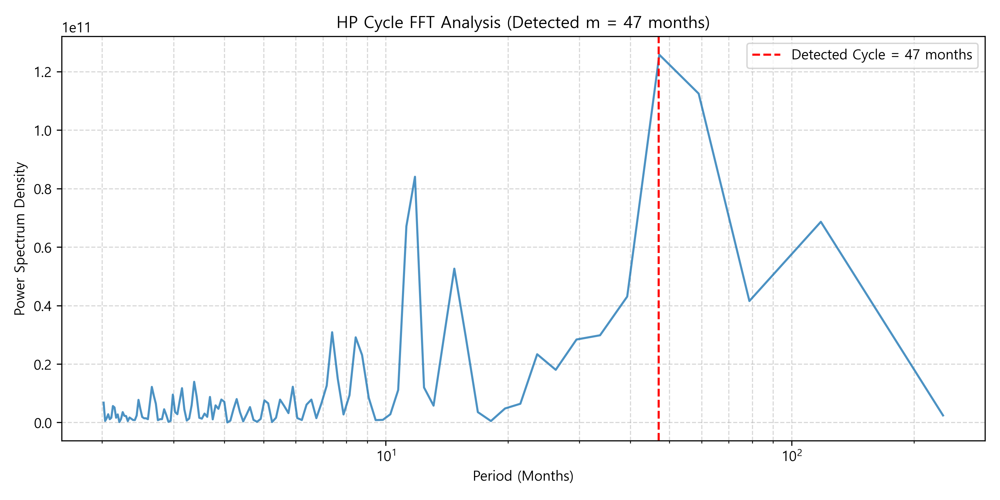
- Main Analysis: figure/동대문구_main_analysis.png

- Ruptures Elbow: figure/동대문구_ruptures_elbow.png
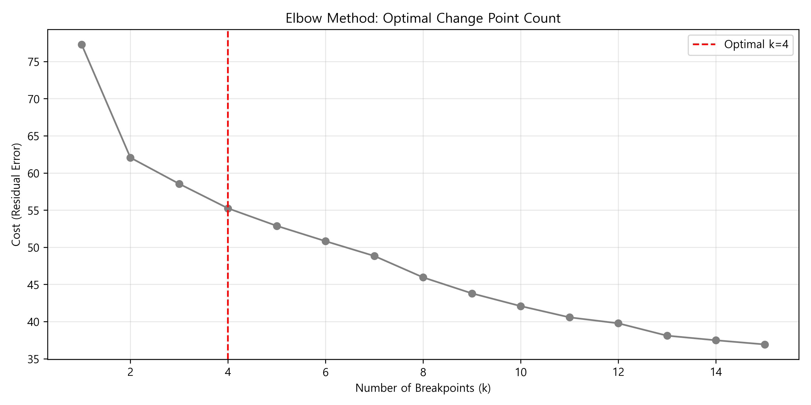

=== 동대문구 분석 ===
 >> [HP Cycle FFT 분석] 감지된 순환 주기: 47.2개월 -> 결정된 m: 47
 >> [위상 분석] 초기 위상(Phase shift): 1.29 rad
 >> [Welch 설정] nperseg: 141 (m의 3.0배)
 >> [Stumpy] Discord(특이 패턴) 발견일: 2021-06
 >> [Ruptures] Elbow Method로 찾은 최적 변화점 개수: 4개
 >> [Ruptures] 감지된 Change Points (총 4개):
    - 2007-08
    - 2016-05
    - 2019-04
    - 2020-02
 >> [IsolationForest] 탐지된 이상치 (총 12개, 5% 기준):
    - 2007-02
    - 2007-03
    - 2007-04
    - 2020-11
    - 2020-12
    - 2021-06
    - 2021-08
    - 2021-09
    - 2021-10
    - 2024-11
    - 2025-06
    - 2025-08
 >> [LOF] 탐지된 이상치 (총 6개, 이웃 N=12 기준):
    - 2007-02
    - 2007-03
    - 2007-04
    - 2020-11
    - 2020-12
    - 2021-08

### 12. 동작구
- FFT Periodogram: figure/동작구_fft_periodogram.png
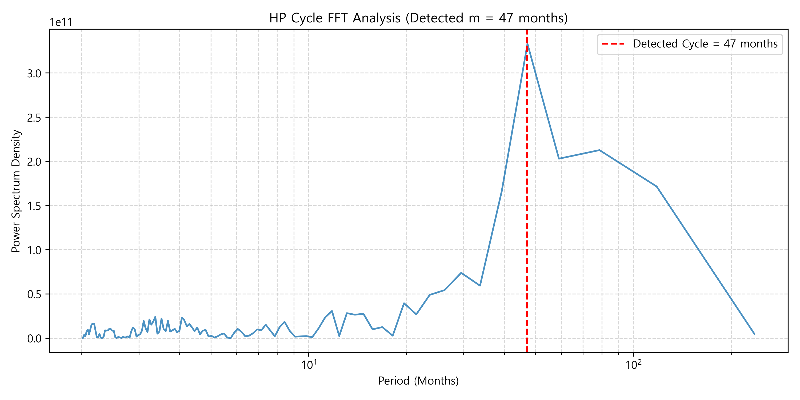
- Main Analysis: figure/동작구_main_analysis.png
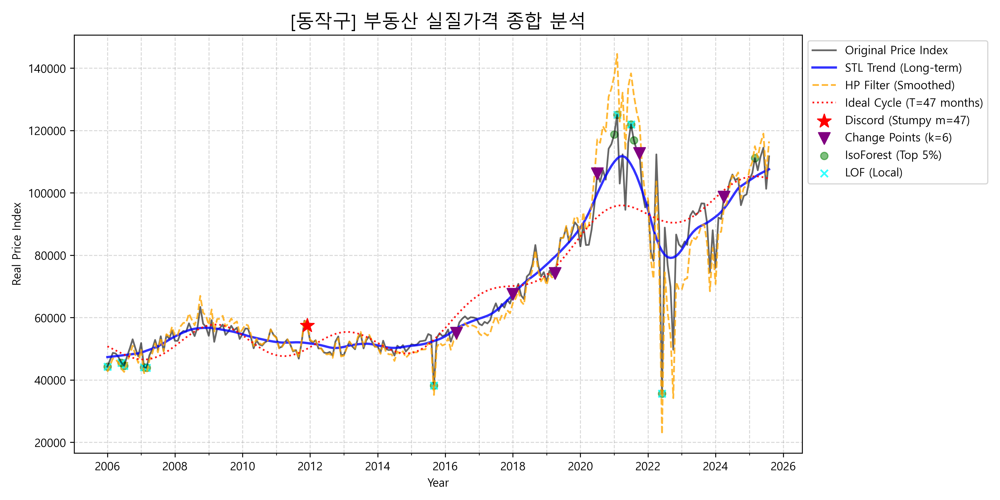
- Ruptures Elbow: figure/동작구_ruptures_elbow.png
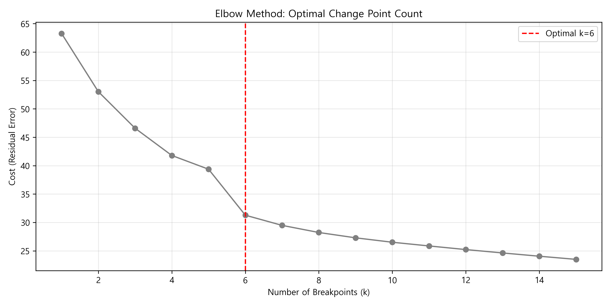

=== 동작구 분석 ===
 >> [HP Cycle FFT 분석] 감지된 순환 주기: 47.2개월 -> 결정된 m: 47
 >> [위상 분석] 초기 위상(Phase shift): 1.17 rad
 >> [Welch 설정] nperseg: 141 (m의 3.0배)
 >> [Stumpy] Discord(특이 패턴) 발견일: 2011-12
 >> [Ruptures] Elbow Method로 찾은 최적 변화점 개수: 6개
 >> [Ruptures] 감지된 Change Points (총 6개):
    - 2016-05
    - 2018-01
    - 2019-04
    - 2020-07
    - 2021-10
    - 2024-04
 >> [IsolationForest] 탐지된 이상치 (총 12개, 5% 기준):
    - 2006-01
    - 2006-06
    - 2006-07
    - 2007-02
    - 2007-03
    - 2015-09
    - 2021-01
    - 2021-02
    - 2021-07
    - 2021-08
    - 2022-06
    - 2025-03
 >> [LOF] 탐지된 이상치 (총 9개, 이웃 N=12 기준):
    - 2006-01
    - 2006-06
    - 2006-07
    - 2007-02
    - 2007-03
    - 2015-09
    - 2021-02
    - 2021-07
    - 2022-06

### 13. 마포구
- FFT Periodogram: figure/마포구_fft_periodogram.png
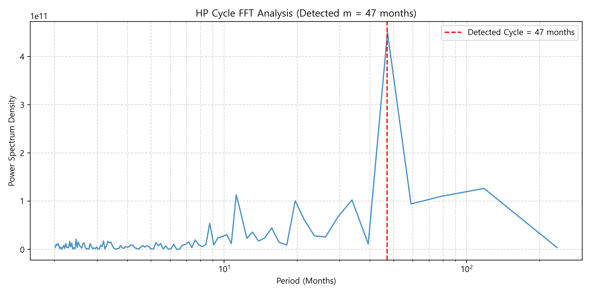
- Main Analysis: figure/마포구_main_analysis.png
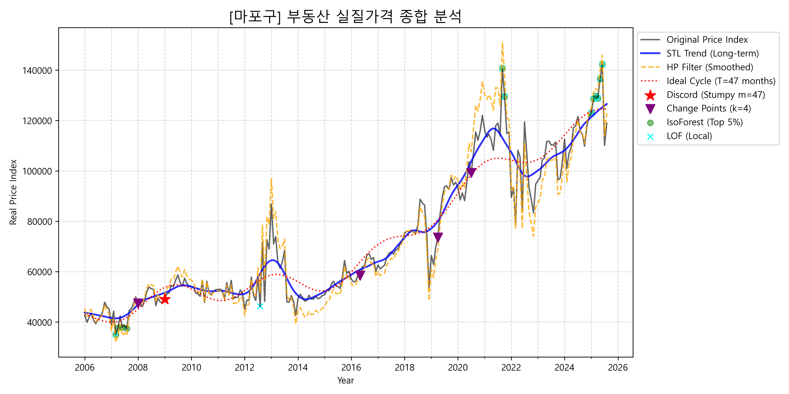
- Ruptures Elbow: figure/마포구_ruptures_elbow.png
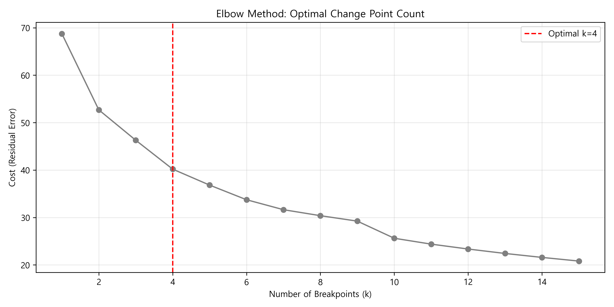

=== 마포구 분석 ===
 >> [HP Cycle FFT 분석] 감지된 순환 주기: 47.2개월 -> 결정된 m: 47
 >> [위상 분석] 초기 위상(Phase shift): 1.09 rad
 >> [Welch 설정] nperseg: 141 (m의 3.0배)
 >> [Stumpy] Discord(특이 패턴) 발견일: 2009-01
 >> [Ruptures] Elbow Method로 찾은 최적 변화점 개수: 4개
 >> [Ruptures] 감지된 Change Points (총 4개):
    - 2008-01
    - 2016-05
    - 2019-04
    - 2020-07
 >> [IsolationForest] 탐지된 이상치 (총 12개, 5% 기준):
    - 2007-03
    - 2007-04
    - 2007-06
    - 2007-08
    - 2021-09
    - 2021-10
    - 2025-01
    - 2025-02
    - 2025-03
    - 2025-04
    - 2025-05
    - 2025-06
 >> [LOF] 탐지된 이상치 (총 10개, 이웃 N=12 기준):
    - 2007-03
    - 2012-08
    - 2021-09
    - 2021-10
    - 2025-01
    - 2025-02
    - 2025-03
    - 2025-04
    - 2025-05
    - 2025-06

### 14. 서대문구
- FFT Periodogram: figure/서대문구_fft_periodogram.png
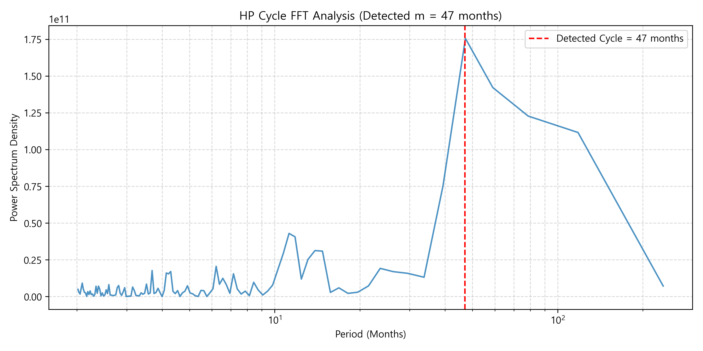
- Main Analysis: figure/서대문구_main_analysis.png
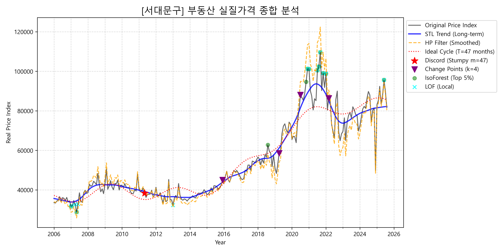
- Ruptures Elbow: figure/서대문구_ruptures_elbow.png
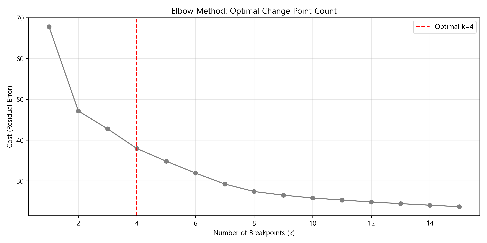

=== 서대문구 분석 ===
 >> [HP Cycle FFT 분석] 감지된 순환 주기: 47.2개월 -> 결정된 m: 47
 >> [위상 분석] 초기 위상(Phase shift): 0.94 rad
 >> [Welch 설정] nperseg: 141 (m의 3.0배)
 >> [Stumpy] Discord(특이 패턴) 발견일: 2011-05
 >> [Ruptures] Elbow Method로 찾은 최적 변화점 개수: 4개
 >> [Ruptures] 감지된 Change Points (총 4개):
    - 2015-12
    - 2019-04
    - 2020-07
    - 2022-03
 >> [IsolationForest] 탐지된 이상치 (총 12개, 5% 기준):
    - 2007-01
    - 2007-05
    - 2018-08
    - 2020-11
    - 2020-12
    - 2021-01
    - 2021-07
    - 2021-08
    - 2021-09
    - 2021-11
    - 2022-01
    - 2025-06
 >> [LOF] 탐지된 이상치 (총 14개, 이웃 N=12 기준):
    - 2007-01
    - 2007-02
    - 2007-04
    - 2007-05
    - 2007-06
    - 2013-01
    - 2020-12
    - 2021-01
    - 2021-07
    - 2021-08
    - 2021-09
    - 2021-11
    - 2022-01
    - 2025-06

### 15. 서초구
- FFT Periodogram: figure/서초구_fft_periodogram.png
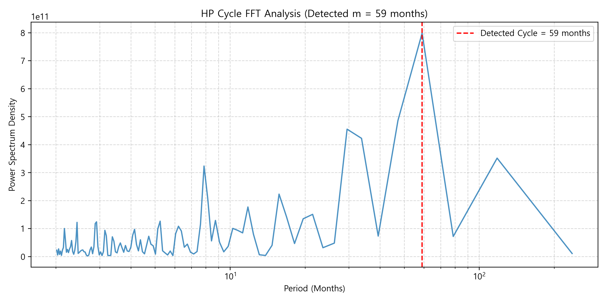
- Main Analysis: figure/서초구_main_analysis.png
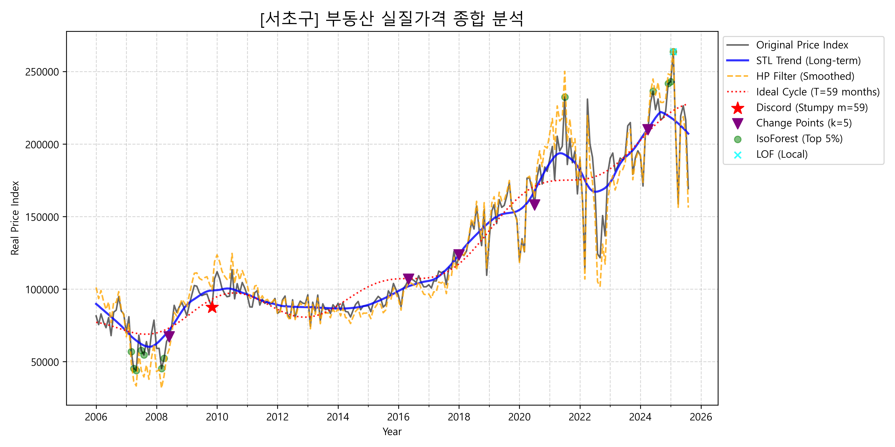
- Ruptures Elbow: figure/서초구_ruptures_elbow.png
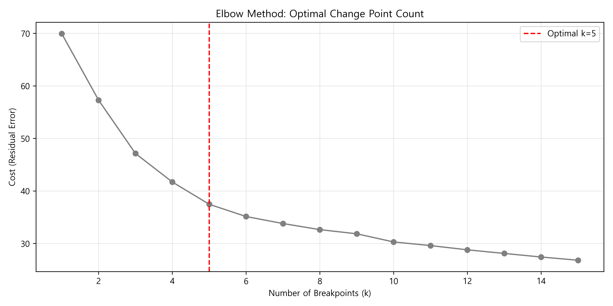

=== 서초구 분석 ===
 >> [HP Cycle FFT 분석] 감지된 순환 주기: 59.0개월 -> 결정된 m: 59
 >> [위상 분석] 초기 위상(Phase shift): 0.60 rad
 >> [Welch 설정] nperseg: 177 (m의 3.0배)
 >> [Stumpy] Discord(특이 패턴) 발견일: 2009-11
 >> [Ruptures] Elbow Method로 찾은 최적 변화점 개수: 5개
 >> [Ruptures] 감지된 Change Points (총 5개):
    - 2008-06
    - 2016-05
    - 2018-01
    - 2020-07
    - 2024-04
 >> [IsolationForest] 탐지된 이상치 (총 12개, 5% 기준):
    - 2007-03
    - 2007-04
    - 2007-05
    - 2007-07
    - 2007-08
    - 2008-03
    - 2008-04
    - 2021-07
    - 2024-06
    - 2024-12
    - 2025-01
    - 2025-02
 >> [LOF] 탐지된 이상치 (총 1개, 이웃 N=12 기준):
    - 2025-02

### 16. 성동구
- FFT Periodogram: figure/성동구_fft_periodogram.png
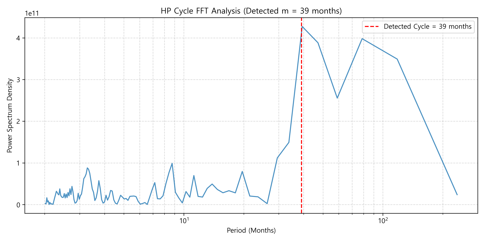
- Main Analysis: figure/성동구_main_analysis.png
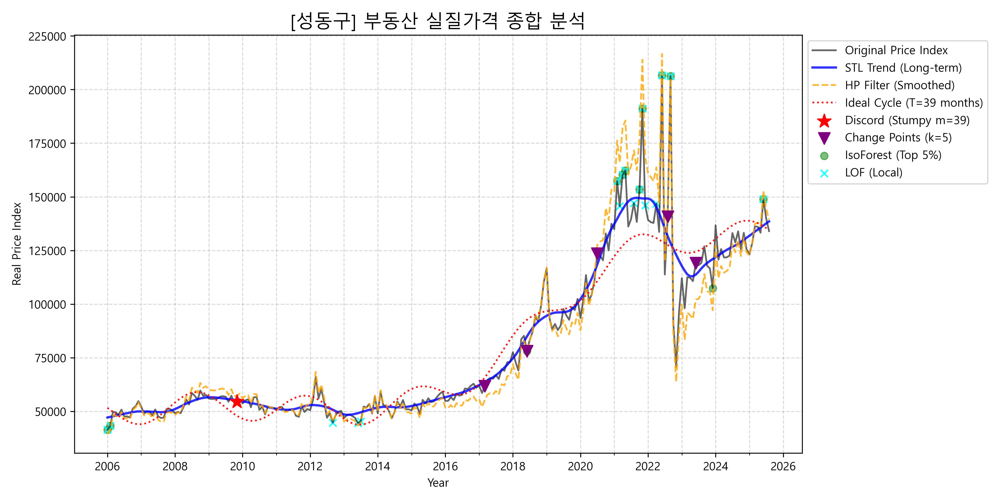
- Ruptures Elbow: figure/성동구_ruptures_elbow.png
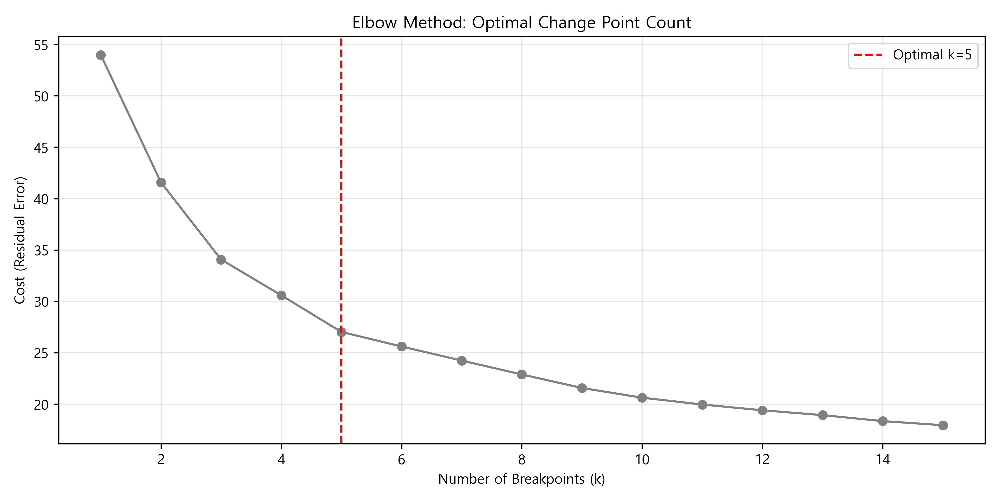

=== 성동구 분석 ===
 >> [HP Cycle FFT 분석] 감지된 순환 주기: 39.3개월 -> 결정된 m: 39
 >> [위상 분석] 초기 위상(Phase shift): 1.20 rad
 >> [Welch 설정] nperseg: 117 (m의 3.0배)
 >> [Stumpy] Discord(특이 패턴) 발견일: 2009-11
 >> [Ruptures] Elbow Method로 찾은 최적 변화점 개수: 5개
 >> [Ruptures] 감지된 Change Points (총 5개):
    - 2017-03
    - 2018-06
    - 2020-07
    - 2022-08
    - 2023-06
 >> [IsolationForest] 탐지된 이상치 (총 12개, 5% 기준):
    - 2006-01
    - 2006-02
    - 2018-06
    - 2021-02
    - 2021-04
    - 2021-05
    - 2021-10
    - 2021-11
    - 2022-06
    - 2022-09
    - 2023-12
    - 2025-06
 >> [LOF] 탐지된 이상치 (총 17개, 이웃 N=12 기준):
    - 2006-01
    - 2006-02
    - 2012-09
    - 2013-06
    - 2013-07
    - 2021-02
    - 2021-03
    - 2021-04
    - 2021-05
    - 2021-08
    - 2021-10
    - 2021-11
    - 2021-12
    - 2022-04
    - 2022-06
    - 2022-09
    - 2025-06

### 17. 성북구
- FFT Periodogram: figure/성북구_fft_periodogram.png
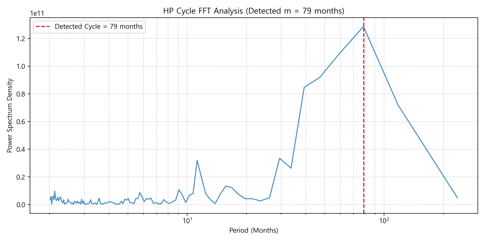
- Main Analysis: figure/성북구_main_analysis.png
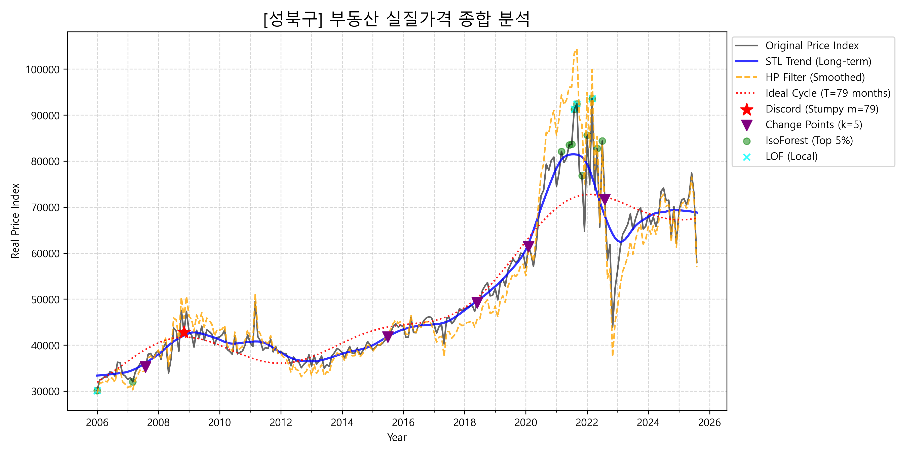
- Ruptures Elbow: figure/성북구_ruptures_elbow.png
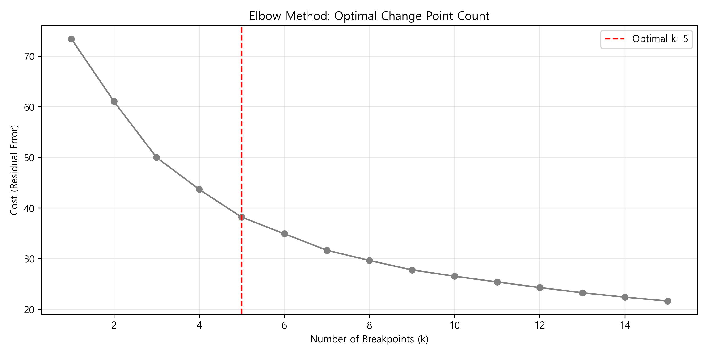

=== 성북구 분석 ===
 >> [HP Cycle FFT 분석] 감지된 순환 주기: 78.7개월 -> 결정된 m: 79
 >> [위상 분석] 초기 위상(Phase shift): -2.34 rad
 >> [Welch 설정] nperseg: 236 (m의 3.0배)
 >> [Stumpy] Discord(특이 패턴) 발견일: 2008-11
 >> [Ruptures] Elbow Method로 찾은 최적 변화점 개수: 5개
 >> [Ruptures] 감지된 Change Points (총 5개):
    - 2007-08
    - 2015-07
    - 2018-06
    - 2020-02
    - 2022-08
 >> [IsolationForest] 탐지된 이상치 (총 12개, 5% 기준):
    - 2006-01
    - 2007-03
    - 2021-03
    - 2021-06
    - 2021-07
    - 2021-08
    - 2021-09
    - 2021-11
    - 2022-01
    - 2022-03
    - 2022-05
    - 2022-07
 >> [LOF] 탐지된 이상치 (총 4개, 이웃 N=12 기준):
    - 2006-01
    - 2021-08
    - 2021-09
    - 2022-03

### 18. 송파구
- FFT Periodogram: figure/송파구_fft_periodogram.png
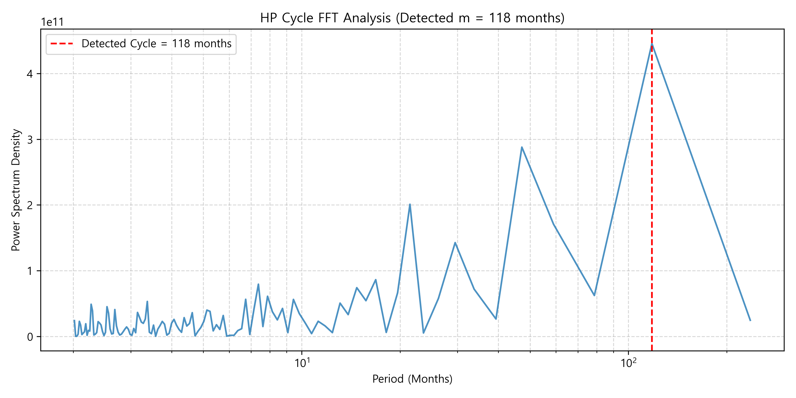
- Main Analysis: figure/송파구_main_analysis.png
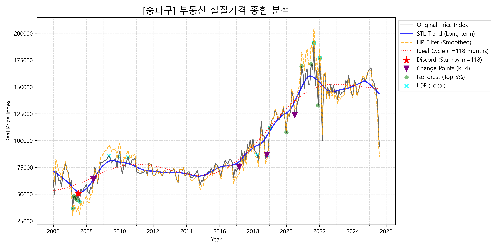
- Ruptures Elbow: figure/송파구_ruptures_elbow.png
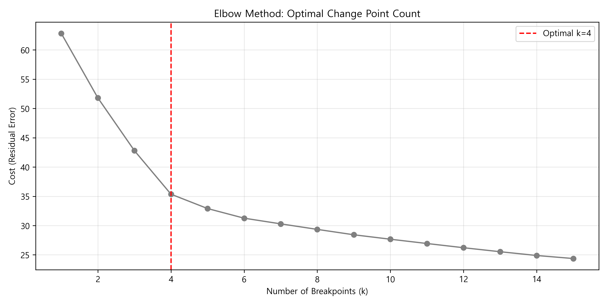

=== 송파구 분석 ===
 >> [HP Cycle FFT 분석] 감지된 순환 주기: 118.0개월 -> 결정된 m: 118
 >> [위상 분석] 초기 위상(Phase shift): 2.92 rad
 >> [Welch 설정] nperseg: 236 (m의 2.0배)
 >> [Stumpy] Discord(특이 패턴) 발견일: 2007-07
 >> [Ruptures] Elbow Method로 찾은 최적 변화점 개수: 4개
 >> [Ruptures] 감지된 Change Points (총 4개):
    - 2008-06
    - 2017-03
    - 2018-11
    - 2020-07
 >> [IsolationForest] 탐지된 이상치 (총 12개, 5% 기준):
    - 2007-03
    - 2007-04
    - 2007-05
    - 2007-06
    - 2007-08
    - 2019-01
    - 2020-01
    - 2020-12
    - 2021-07
    - 2021-09
    - 2021-12
    - 2022-01
 >> [LOF] 탐지된 이상치 (총 10개, 이웃 N=12 기준):
    - 2007-03
    - 2007-08
    - 2009-05
    - 2009-12
    - 2010-07
    - 2018-04
    - 2018-11
    - 2019-01
    - 2021-09
    - 2022-01

### 19. 양천구
- FFT Periodogram: figure/양천구_fft_periodogram.png
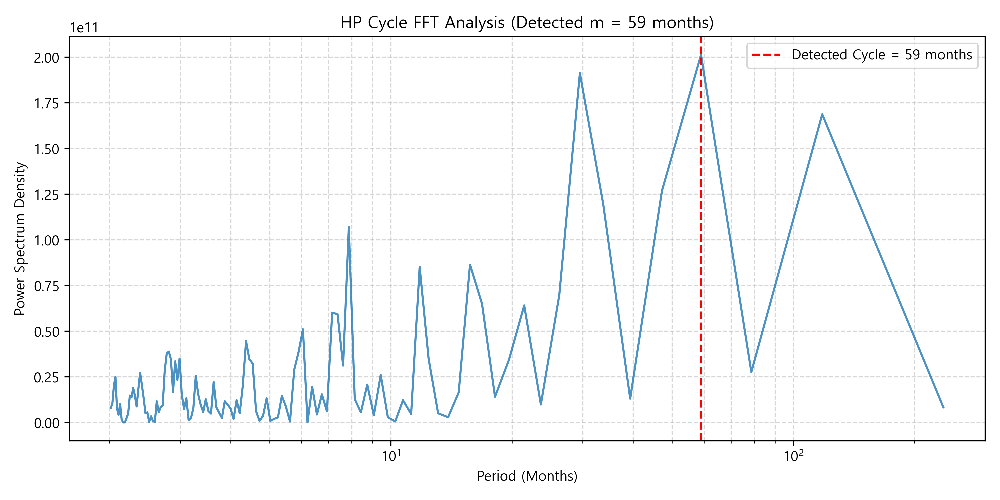
- Main Analysis: figure/양천구_main_analysis.png
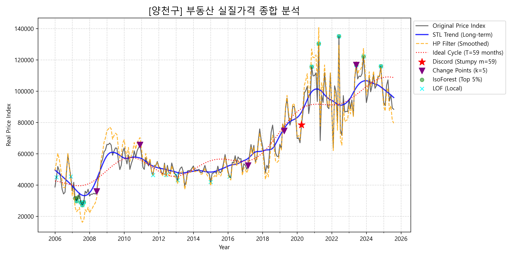
- Ruptures Elbow: figure/양천구_ruptures_elbow.png
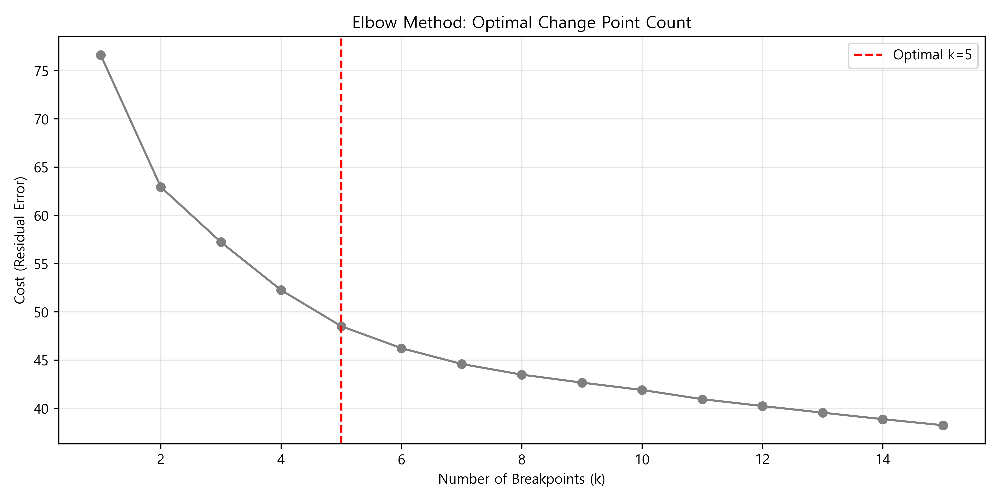

=== 양천구 분석 ===
 >> [HP Cycle FFT 분석] 감지된 순환 주기: 59.0개월 -> 결정된 m: 59
 >> [위상 분석] 초기 위상(Phase shift): 0.78 rad
 >> [Welch 설정] nperseg: 177 (m의 3.0배)
 >> [Stumpy] Discord(특이 패턴) 발견일: 2020-04
 >> [Ruptures] Elbow Method로 찾은 최적 변화점 개수: 5개
 >> [Ruptures] 감지된 Change Points (총 5개):
    - 2008-06
    - 2010-12
    - 2017-03
    - 2019-04
    - 2023-06
 >> [IsolationForest] 탐지된 이상치 (총 12개, 5% 기준):
    - 2007-03
    - 2007-04
    - 2007-05
    - 2007-07
    - 2007-08
    - 2007-09
    - 2020-11
    - 2021-04
    - 2022-06
    - 2023-06
    - 2023-11
    - 2024-11
 >> [LOF] 탐지된 이상치 (총 18개, 이웃 N=12 기준):
    - 2006-02
    - 2006-12
    - 2007-04
    - 2007-07
    - 2007-08
    - 2007-09
    - 2011-09
    - 2012-06
    - 2013-01
    - 2013-02
    - 2015-01
    - 2016-02
    - 2020-11
    - 2021-04
    - 2022-06
    - 2023-06
    - 2023-11
    - 2024-11

### 20. 영등포구
- FFT Periodogram: figure/영등포구_fft_periodogram.png
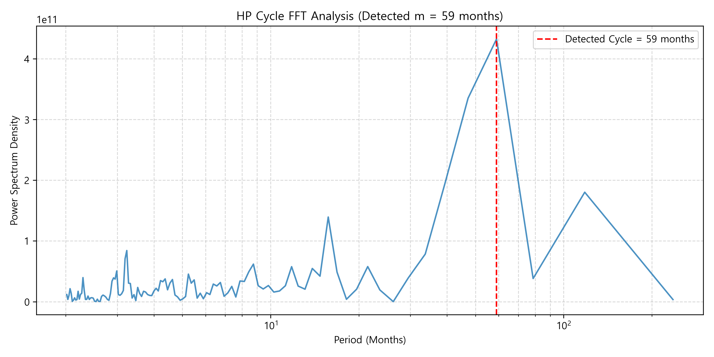
- Main Analysis: figure/영등포구_main_analysis.png
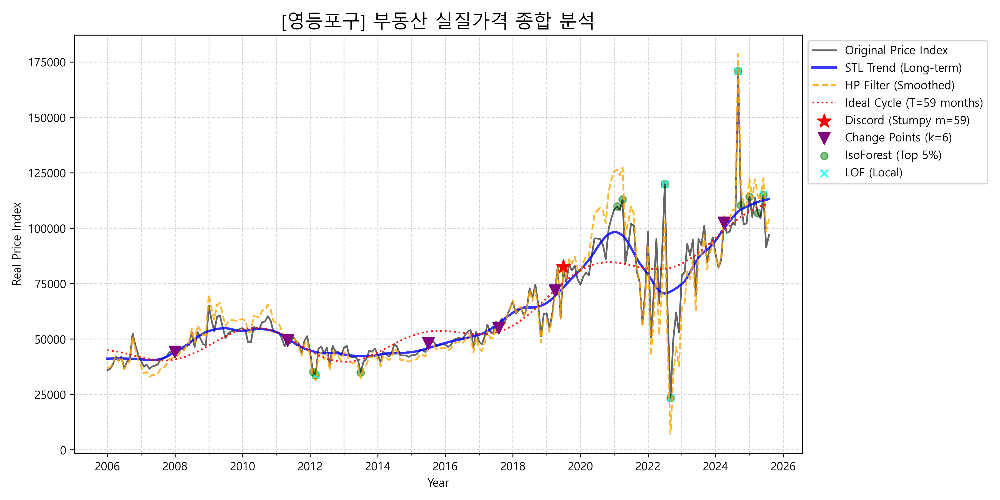
- Ruptures Elbow: figure/영등포구_ruptures_elbow.png
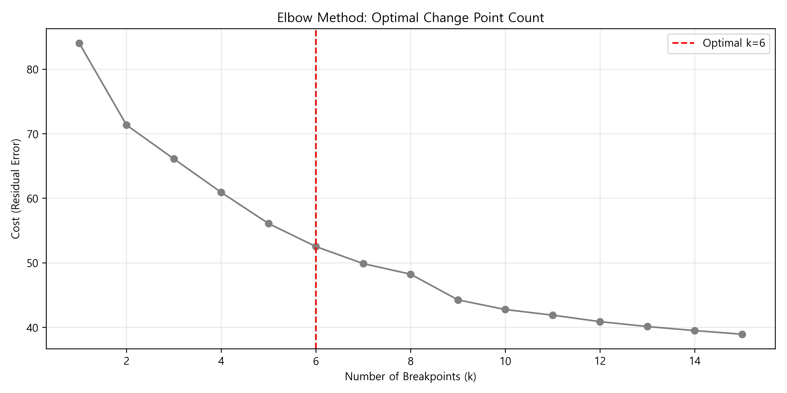

=== 영등포구 분석 ===
 >> [HP Cycle FFT 분석] 감지된 순환 주기: 59.0개월 -> 결정된 m: 59
 >> [위상 분석] 초기 위상(Phase shift): 0.60 rad
 >> [Welch 설정] nperseg: 177 (m의 3.0배)
 >> [Stumpy] Discord(특이 패턴) 발견일: 2019-07
 >> [Ruptures] Elbow Method로 찾은 최적 변화점 개수: 6개
 >> [Ruptures] 감지된 Change Points (총 6개):
    - 2008-01
    - 2011-05
    - 2015-07
    - 2017-08
    - 2019-04
    - 2024-04
 >> [IsolationForest] 탐지된 이상치 (총 12개, 5% 기준):
    - 2012-02
    - 2012-03
    - 2013-07
    - 2021-02
    - 2021-04
    - 2022-07
    - 2022-09
    - 2024-09
    - 2024-10
    - 2025-01
    - 2025-04
    - 2025-06
 >> [LOF] 탐지된 이상치 (총 5개, 이웃 N=12 기준):
    - 2012-03
    - 2022-07
    - 2022-09
    - 2024-09
    - 2025-06

### 21. 용산구
- FFT Periodogram: figure/용산구_fft_periodogram.png
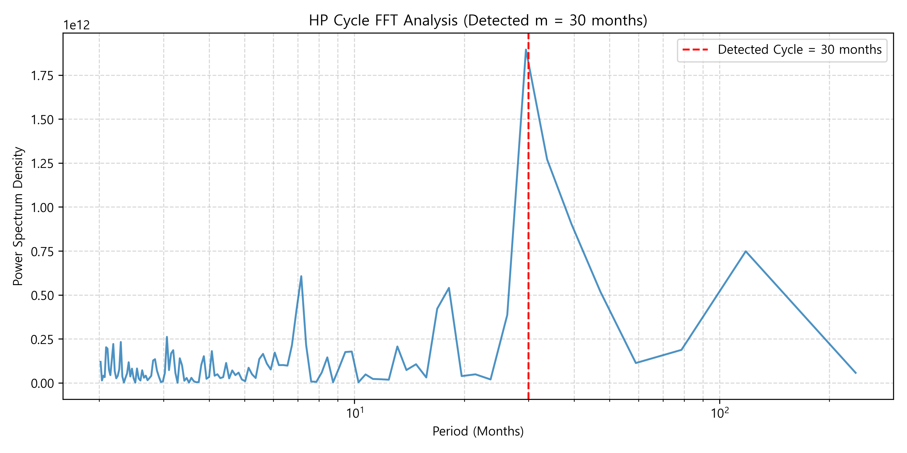
- Main Analysis: figure/용산구_main_analysis.png
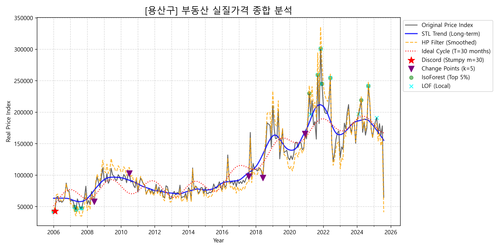
- Ruptures Elbow: figure/용산구_ruptures_elbow.png
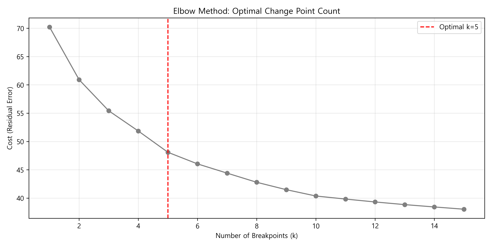

=== 용산구 분석 ===
 >> [HP Cycle FFT 분석] 감지된 순환 주기: 29.5개월 -> 결정된 m: 30
 >> [위상 분석] 초기 위상(Phase shift): -2.21 rad
 >> [Welch 설정] nperseg: 90 (m의 3.0배)
 >> [Stumpy] Discord(특이 패턴) 발견일: 2006-02
 >> [Ruptures] Elbow Method로 찾은 최적 변화점 개수: 5개
 >> [Ruptures] 감지된 Change Points (총 5개):
    - 2008-06
    - 2010-07
    - 2017-08
    - 2018-06
    - 2020-12
 >> [IsolationForest] 탐지된 이상치 (총 12개, 5% 기준):
    - 2006-01
    - 2006-02
    - 2007-04
    - 2007-05
    - 2007-09
    - 2021-03
    - 2021-09
    - 2021-11
    - 2021-12
    - 2022-06
    - 2024-04
    - 2024-09
 >> [LOF] 탐지된 이상치 (총 14개, 이웃 N=12 기준):
    - 2006-01
    - 2006-02
    - 2007-04
    - 2007-05
    - 2007-08
    - 2007-09
    - 2021-04
    - 2021-09
    - 2021-11
    - 2021-12
    - 2022-06
    - 2024-02
    - 2024-09
    - 2025-03

### 22. 은평구
- FFT Periodogram: figure/은평구_fft_periodogram.png
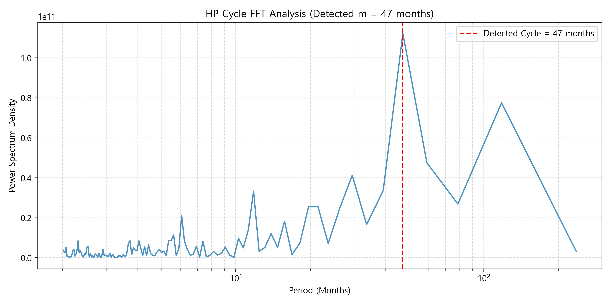
- Main Analysis: figure/은평구_main_analysis.png
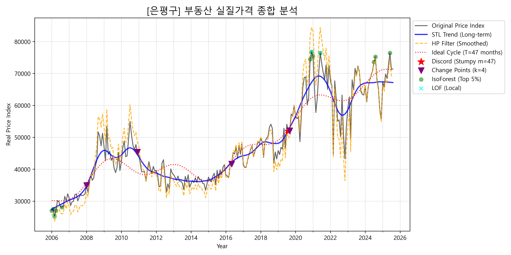
- Ruptures Elbow: figure/은평구_ruptures_elbow.png
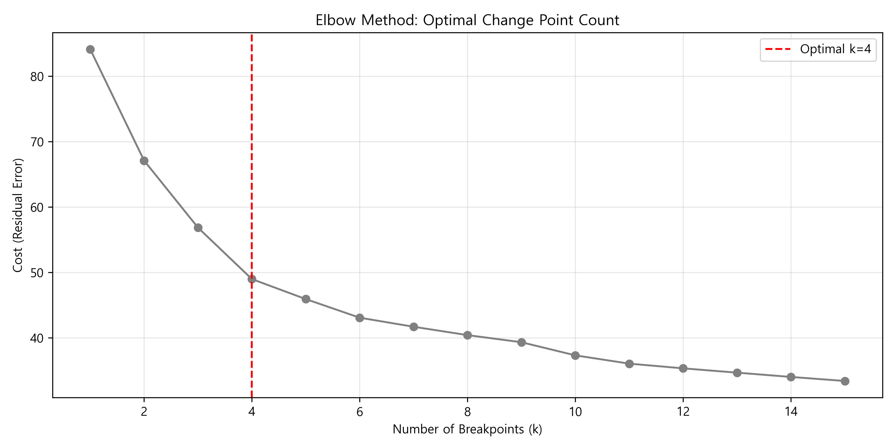

=== 은평구 분석 ===
 >> [HP Cycle FFT 분석] 감지된 순환 주기: 47.2개월 -> 결정된 m: 47
 >> [위상 분석] 초기 위상(Phase shift): 1.07 rad
 >> [Welch 설정] nperseg: 141 (m의 3.0배)
 >> [Stumpy] Discord(특이 패턴) 발견일: 2019-08
 >> [Ruptures] Elbow Method로 찾은 최적 변화점 개수: 4개
 >> [Ruptures] 감지된 Change Points (총 4개):
    - 2008-01
    - 2010-12
    - 2016-05
    - 2019-09
 >> [IsolationForest] 탐지된 이상치 (총 12개, 5% 기준):
    - 2006-01
    - 2006-02
    - 2006-03
    - 2006-04
    - 2006-08
    - 2020-11
    - 2020-12
    - 2021-01
    - 2021-06
    - 2024-07
    - 2024-08
    - 2025-06
 >> [LOF] 탐지된 이상치 (총 3개, 이웃 N=12 기준):
    - 2006-03
    - 2020-12
    - 2021-06

### 23. 종로구
- FFT Periodogram: figure/종로구_fft_periodogram.png

- Main Analysis: figure/종로구_main_analysis.png

- Ruptures Elbow: figure/종로구_ruptures_elbow.png


=== 종로구 분석 ===
 >> [HP Cycle FFT 분석] 감지된 순환 주기: 47.2개월 -> 결정된 m: 47
 >> [위상 분석] 초기 위상(Phase shift): 1.70 rad
 >> [Welch 설정] nperseg: 141 (m의 3.0배)
 >> [Stumpy] Discord(특이 패턴) 발견일: 2008-09
 >> [Ruptures] Elbow Method로 찾은 최적 변화점 개수: 6개
 >> [Ruptures] 감지된 Change Points (총 6개):
    - 2008-06
    - 2016-10
    - 2019-04
    - 2020-07
    - 2021-05
    - 2023-01
 >> [IsolationForest] 탐지된 이상치 (총 12개, 5% 기준):
    - 2006-08
    - 2022-07
    - 2022-08
    - 2022-10
    - 2022-11
    - 2023-06
    - 2023-08
    - 2025-02
    - 2025-03
    - 2025-05
    - 2025-06
    - 2025-07
 >> [LOF] 탐지된 이상치 (총 10개, 이웃 N=12 기준):
    - 2006-08
    - 2022-07
    - 2022-08
    - 2022-10
    - 2022-11
    - 2023-08
    - 2025-02
    - 2025-03
    - 2025-05
    - 2025-06

### 24. 중구
- FFT Periodogram: figure/중구_fft_periodogram.png
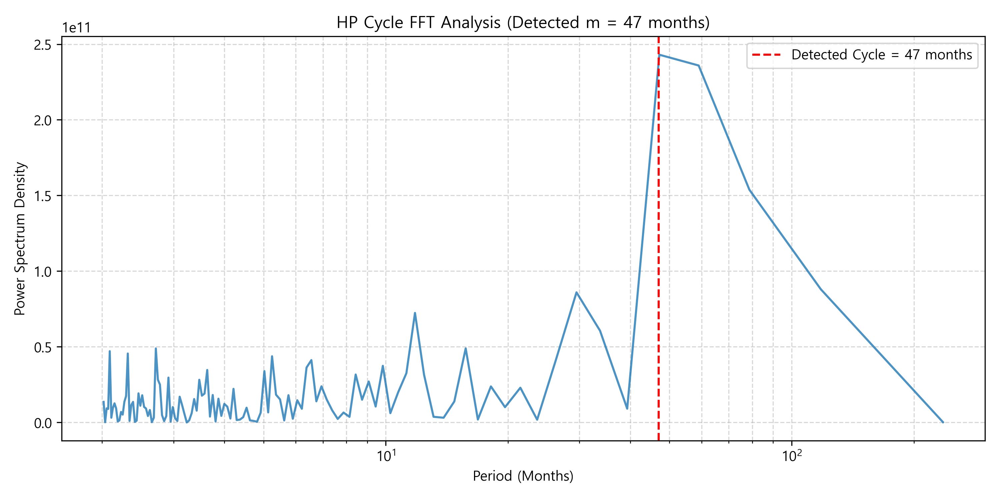
- Main Analysis: figure/중구_main_analysis.png
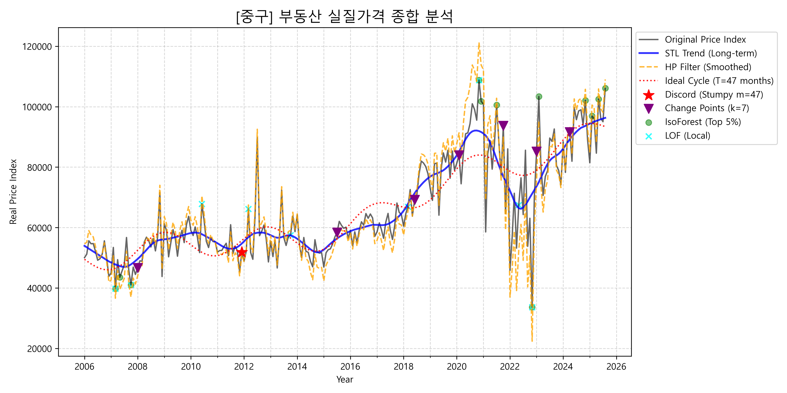
- Ruptures Elbow: figure/중구_ruptures_elbow.png
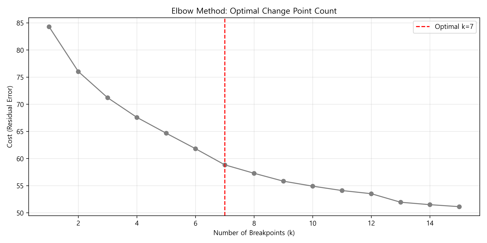

=== 중구 분석 ===
 >> [HP Cycle FFT 분석] 감지된 순환 주기: 47.2개월 -> 결정된 m: 47
 >> [위상 분석] 초기 위상(Phase shift): 1.56 rad
 >> [Welch 설정] nperseg: 141 (m의 3.0배)
 >> [Stumpy] Discord(특이 패턴) 발견일: 2011-12
 >> [Ruptures] Elbow Method로 찾은 최적 변화점 개수: 7개
 >> [Ruptures] 감지된 Change Points (총 7개):
    - 2008-01
    - 2015-07
    - 2018-06
    - 2020-02
    - 2021-10
    - 2023-01
    - 2024-04
 >> [IsolationForest] 탐지된 이상치 (총 12개, 5% 기준):
    - 2007-03
    - 2007-05
    - 2007-10
    - 2020-11
    - 2020-12
    - 2021-07
    - 2022-11
    - 2023-02
    - 2024-11
    - 2025-02
    - 2025-05
    - 2025-08
 >> [LOF] 탐지된 이상치 (총 9개, 이웃 N=12 기준):
    - 2007-03
    - 2007-10
    - 2010-06
    - 2012-03
    - 2013-10
    - 2018-03
    - 2020-11
    - 2022-05
    - 2022-11

### 25. 중랑구
- FFT Periodogram: figure/중랑구_fft_periodogram.png
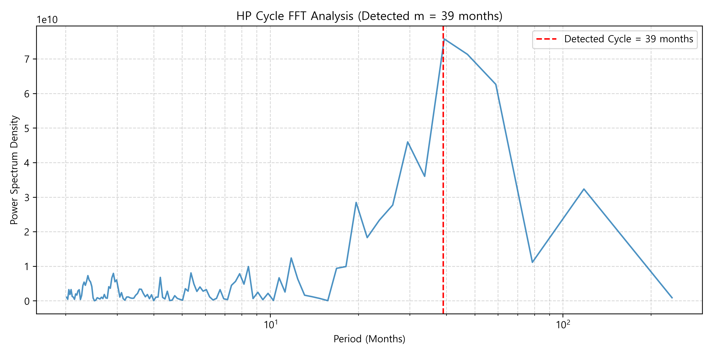
- Main Analysis: figure/중랑구_main_analysis.png
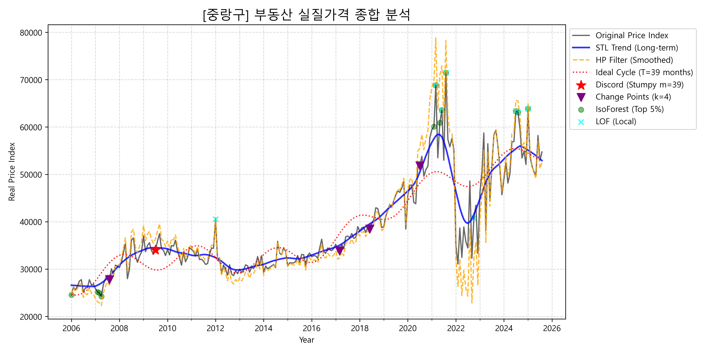
- Ruptures Elbow: figure/중랑구_ruptures_elbow.png
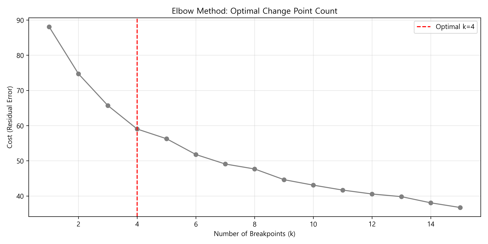

=== 중랑구 분석 ===
 >> [HP Cycle FFT 분석] 감지된 순환 주기: 39.3개월 -> 결정된 m: 39
 >> [위상 분석] 초기 위상(Phase shift): 2.38 rad
 >> [Welch 설정] nperseg: 117 (m의 3.0배)
 >> [Stumpy] Discord(특이 패턴) 발견일: 2009-07
 >> [Ruptures] Elbow Method로 찾은 최적 변화점 개수: 4개
 >> [Ruptures] 감지된 Change Points (총 4개):
    - 2007-08
    - 2017-03
    - 2018-06
    - 2020-07
 >> [IsolationForest] 탐지된 이상치 (총 12개, 5% 기준):
    - 2006-01
    - 2007-02
    - 2007-03
    - 2007-04
    - 2021-02
    - 2021-03
    - 2021-05
    - 2021-06
    - 2021-08
    - 2024-07
    - 2024-08
    - 2025-01
 >> [LOF] 탐지된 이상치 (총 8개, 이웃 N=12 기준):
    - 2012-01
    - 2021-03
    - 2021-06
    - 2021-08
    - 2022-10
    - 2024-07
    - 2024-08
    - 2025-01

---
[Back to Table of Contents](#table-of-contents)

## **B. PanelOLS Full Output (Entity FE + Time FE)**

본 절은 본문에서 요약하여 제시한 PanelOLS 추정 결과의 **전체 전문 출력**을 포함한다.
모델은 **Entity Fixed Effects + Time Fixed Effects**, 공분산 추정은 **Clustered** 옵션을 사용하였다.
수치는 Python `linearmodels` 패키지의 `PanelOLS` 결과를 그대로 제시한다.

---

### **(1) Model Specification**

* **Dependent variable:** `real_std`
* **Regressor:** `Factor1` (Dynamic Factor Model에서 추출한 1st common factor)
* **Fixed Effects:** Entity FE, Time FE
* **Covariance Estimator:** Clustered
* **Observations:** 5900
* **Entities:** 25개 구
* **Time periods:** 236개월

---

### **(2) PanelOLS Estimation Summary (Raw Output)**

```
PanelOLS Estimation Summary
================================================================================
Dep. Variable:               real_std   R-squared:                        0.0000
Estimator:                   PanelOLS   R-squared (Between):          -1.322e+24
No. Observations:                5900   R-squared (Within):               0.3010
Date:                Mon, Nov 24 2025   R-squared (Overall):              0.3010
Time:                        19:17:46   Log-likelihood                   -2700.2
Cov. Estimator:             Clustered
                                        F-statistic:                      0.0000
Entities:                          25   P-value                           1.0000
Avg Obs:                       236.00   Distribution:                  F(1,5639)
Min Obs:                       236.00
Max Obs:                       236.00   F-statistic (robust):          2.395e-30
                                        P-value                           1.0000
Time periods:                     236   Distribution:                  F(1,5639)
Avg Obs:                       25.000
Min Obs:                       25.000
Max Obs:                       25.000

                             Parameter Estimates
==============================================================================
            Parameter  Std. Err.     T-stat    P-value    Lower CI    Upper CI
------------------------------------------------------------------------------
Factor1        0.0171  1.107e+13  1.547e-15     1.0000   -2.17e+13    2.17e+13
==============================================================================

F-test for Poolability: 0.4787
P-value: 1.0000
Distribution: F(259,5639)

Included effects: Entity, Time
```

---
## License
This project is licensed under the MIT License. See the LICENSE file for details.

## Open Source Notice  
This project uses open-source Python libraries.
All dependencies are listed in the source code imports.
---
